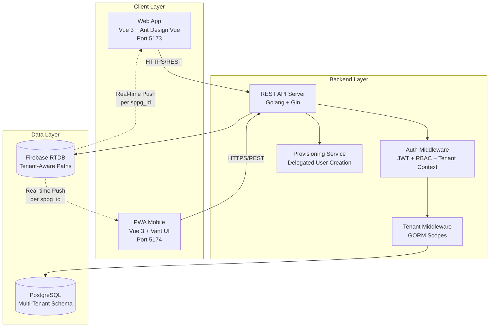
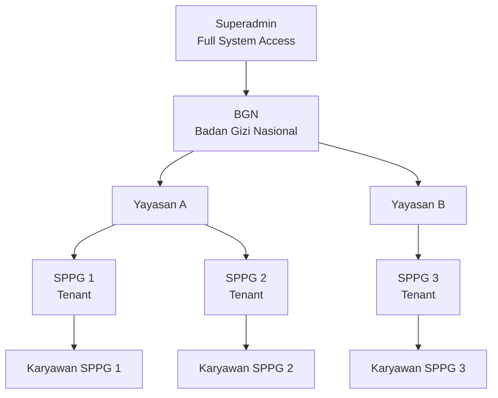
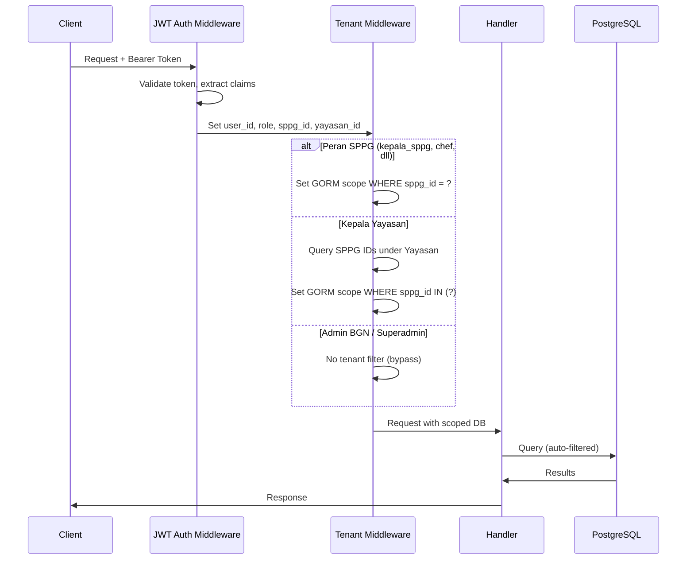

# Dokumen Desain: Multi-Tenancy & Hierarki Organisasi

## Overview

Dokumen ini menjelaskan desain teknis untuk mentransformasi Sistem ERP SPPG dari arsitektur single-tenant menjadi platform multi-tenant dengan hierarki organisasi bertingkat. Transformasi ini mencakup:

1. **Entitas organisasi baru**: Yayasan dan SPPG sebagai tenant, dengan BGN sebagai otoritas tertinggi
2. **Peran baru**: `superadmin`, `admin_bgn`, `kepala_yayasan` — masing-masing dengan scope akses berbeda
3. **Isolasi data tenant**: Kolom `sppg_id` pada semua tabel operasional, dengan tenant middleware untuk filtering otomatis
4. **Delegated provisioning**: Pembuatan akun berjenjang sesuai hierarki
5. **Dashboard agregasi**: Untuk Kepala Yayasan (lintas SPPG) dan Admin BGN (lintas Yayasan)
6. **Firebase tenant-aware**: Path Firebase menyertakan `sppg_id`
7. **Migrasi data**: Dari single-tenant ke multi-tenant dengan Yayasan/SPPG default
8. **PWA mobile**: Dukungan monitoring untuk Admin BGN dan Kepala Yayasan

### Prinsip Desain

- **Backward Compatibility**: Semua endpoint API v1 yang ada tetap berfungsi tanpa perubahan request format
- **Fail-Closed Security**: Jika tenant middleware gagal, akses ditolak secara default
- **Minimal Invasive**: Extend model dan middleware yang ada, bukan replace
- **GORM Scopes**: Gunakan GORM scopes untuk tenant filtering agar konsisten dan testable
- **Progressive Enhancement**: Peran baru ditambahkan tanpa mengganggu peran yang sudah ada

## Architecture

### Arsitektur Multi-Tenant



### Hierarki Organisasi



### Alur Request dengan Tenant Context



## Components and Interfaces

### 1. Entitas Organisasi Baru

#### YayasanService

Mengelola CRUD Yayasan dengan auto-generate kode unik.

```
POST   /api/v1/organizations/yayasan          — Buat Yayasan baru
GET    /api/v1/organizations/yayasan          — Daftar semua Yayasan
GET    /api/v1/organizations/yayasan/:id      — Detail Yayasan
PUT    /api/v1/organizations/yayasan/:id      — Update Yayasan
PATCH  /api/v1/organizations/yayasan/:id/status — Aktifkan/nonaktifkan Yayasan
```

#### SPPGService

Mengelola CRUD SPPG dengan relasi ke Yayasan.

```
POST   /api/v1/organizations/sppg             — Buat SPPG baru
GET    /api/v1/organizations/sppg             — Daftar semua SPPG
GET    /api/v1/organizations/sppg/:id         — Detail SPPG
PUT    /api/v1/organizations/sppg/:id         — Update SPPG
PATCH  /api/v1/organizations/sppg/:id/status  — Aktifkan/nonaktifkan SPPG
PUT    /api/v1/organizations/sppg/:id/transfer — Pindahkan SPPG ke Yayasan lain
```

### 2. Tenant Middleware

Komponen middleware baru yang menyisipkan GORM scopes berdasarkan konteks tenant pengguna.

```go
// TenantMiddleware mengekstrak tenant context dari JWT dan menyisipkan GORM scope
func TenantMiddleware(db *gorm.DB) gin.HandlerFunc
```

**Behavior per role:**

| Role | Tenant Filter | Write Behavior |
|------|--------------|----------------|
| Peran SPPG | `WHERE sppg_id = ?` | Auto-inject `sppg_id` pada INSERT |
| kepala_yayasan | `WHERE sppg_id IN (?)` | Tidak boleh write data operasional |
| admin_bgn | Tidak ada filter | Tidak boleh write data operasional (kecuali Yayasan/SPPG CRUD) |
| superadmin | Tidak ada filter | Full write access |

### 3. Perubahan Auth Service

JWT claims diperluas untuk menyertakan informasi tenant:

```go
type JWTClaims struct {
    UserID     uint    `json:"user_id"`
    Role       string  `json:"role"`
    SPPGID     *uint   `json:"sppg_id,omitempty"`
    YayasanID  *uint   `json:"yayasan_id,omitempty"`
    jwt.RegisteredClaims
}
```

### 4. Provisioning Service

Mengelola pembuatan akun pengguna berjenjang.

```
POST   /api/v1/users                          — Buat user baru (delegated)
GET    /api/v1/users                          — Daftar user (scoped)
GET    /api/v1/users/:id                      — Detail user
PUT    /api/v1/users/:id                      — Update user
PATCH  /api/v1/users/:id/status               — Aktifkan/nonaktifkan user
```

**Aturan provisioning:**

| Pembuat | Peran yang Boleh Dibuat | Scope |
|---------|------------------------|-------|
| superadmin | Semua peran | Seluruh sistem |
| admin_bgn | — (tidak boleh) | — |
| kepala_yayasan | kepala_sppg, peran operasional | SPPG di bawah Yayasan-nya |
| kepala_sppg | Peran operasional | SPPG-nya sendiri |

### 5. Dashboard Agregasi

#### Dashboard Kepala Yayasan (Agregasi lintas SPPG)

```
GET /api/v1/dashboard/kepala-yayasan?start_date=&end_date=&sppg_id=
```

Menampilkan:
- Metrik produksi agregat dari semua SPPG di bawah Yayasan
- Metrik pengiriman agregat
- Metrik keuangan agregat
- Monitoring ulasan/review agregat
- Daftar SPPG dengan ringkasan performa
- Drill-down ke SPPG tertentu

#### Dashboard Admin BGN (Agregasi nasional)

```
GET /api/v1/dashboard/admin-bgn?start_date=&end_date=&yayasan_id=&sppg_id=
```

Menampilkan:
- Metrik produksi agregat dari seluruh SPPG
- Metrik pengiriman agregat nasional
- Metrik keuangan agregat nasional
- Monitoring ulasan/review agregat nasional
- Daftar Yayasan dengan ringkasan performa
- Drill-down ke Yayasan → SPPG

### 6. Firebase Tenant-Aware

Struktur path Firebase diubah untuk menyertakan `sppg_id`:

```
/kds/cooking/{sppg_id}/{date}/{recipe_id}
/kds/packing/{sppg_id}/{date}/{school_id}
/dashboard/kepala_sppg/{sppg_id}/...
/dashboard/kepala_yayasan/{yayasan_id}/...
/dashboard/bgn/...
/monitoring/{sppg_id}/{date}/...
/cleaning/{sppg_id}/pending/...
```

### 7. Matriks Visibilitas Modul

```
GET /api/v1/auth/me  — Response diperluas dengan field `modules` dan `permissions`
```

| Modul | superadmin | admin_bgn | kepala_yayasan | kepala_sppg | Operasional |
|-------|-----------|-----------|----------------|-------------|-------------|
| Manajemen Yayasan | ✓ CRUD | ✓ CRUD | ✗ | ✗ | ✗ |
| Manajemen SPPG | ✓ CRUD | ✓ CRUD | ✗ | ✗ | ✗ |
| User Provisioning (semua) | ✓ | ✗ | ✗ | ✗ | ✗ |
| User Provisioning (scope) | — | ✗ | ✓ (SPPG-nya) | ✓ (SPPG-nya) | ✗ |
| Dashboard BGN | ✓ | ✓ | ✗ | ✗ | ✗ |
| Dashboard Yayasan | ✓ | ✓ | ✓ | ✗ | ✗ |
| Dashboard SPPG | ✓ | ✓ | ✓ (drill-down) | ✓ | ✗ |
| System Config | ✓ | ✗ | ✗ | ✗ | ✗ |
| Audit Trail | ✓ (semua) | ✓ (lintas tenant) | ✓ (scope Yayasan) | ✓ (scope SPPG) | ✗ |
| Laporan Keuangan | ✓ | ✓ (read) | ✓ (read) | ✓ | ✓ (akuntan) |
| Data Logistik | ✓ | ✓ (read) | ✓ (read) | ✓ | ✓ (driver, asisten) |
| Inventaris | ✓ | ✓ (read) | ✓ (read) | ✓ | ✓ (pengadaan) |
| Review/Ulasan | ✓ | ✓ (read) | ✓ (read) | ✓ | ✓ |
| KDS, Menu, Cooking, dll | ✗ | ✗ | ✗ | ✓ | ✓ (sesuai peran) |

### 8. Migrasi Data

Proses migrasi single-tenant ke multi-tenant:

1. Buat tabel `yayasans` dan `sppgs`
2. Insert Yayasan default ("Yayasan Default", kode "YYS-0001")
3. Insert SPPG default ("SPPG Default", kode "SPPG-0001", yayasan_id = 1)
4. Tambahkan kolom `sppg_id` pada semua tabel operasional
5. Update semua record existing: `SET sppg_id = 1`
6. Tambahkan kolom `sppg_id` dan `yayasan_id` pada tabel `users`
7. Update user existing dengan peran SPPG: `SET sppg_id = 1`
8. Buat akun superadmin default
9. Tambahkan indeks pada kolom `sppg_id`
10. Validasi: pastikan tidak ada record dengan `sppg_id = NULL` pada tabel operasional

## Data Models

### Entitas Organisasi Baru

```go
// Yayasan merepresentasikan yayasan/lembaga yang mengelola SPPG
type Yayasan struct {
    ID                uint      `gorm:"primaryKey" json:"id"`
    Kode              string    `gorm:"uniqueIndex;size:20;not null" json:"kode"`           // Format: YYS-XXXX
    Nama              string    `gorm:"size:200;not null;index" json:"nama" validate:"required"`
    Alamat            string    `gorm:"type:text" json:"alamat"`
    NomorTelepon      string    `gorm:"size:20" json:"nomor_telepon"`
    Email             string    `gorm:"uniqueIndex;size:100" json:"email" validate:"omitempty,email"`
    PenanggungJawab   string    `gorm:"size:100" json:"penanggung_jawab"`
    NPWP              string    `gorm:"uniqueIndex;size:30" json:"npwp"`
    IsActive          bool      `gorm:"default:true;index" json:"is_active"`
    CreatedAt         time.Time `json:"created_at"`
    UpdatedAt         time.Time `json:"updated_at"`
    SPPGs             []SPPG    `gorm:"foreignKey:YayasanID" json:"sppgs,omitempty"`
}

// SPPG merepresentasikan Satuan Pelayanan Pemenuhan Gizi (tenant)
type SPPG struct {
    ID           uint      `gorm:"primaryKey" json:"id"`
    Kode         string    `gorm:"uniqueIndex;size:20;not null" json:"kode"`              // Format: SPPG-XXXX
    Nama         string    `gorm:"size:200;not null;index" json:"nama" validate:"required"`
    Alamat       string    `gorm:"type:text" json:"alamat"`
    NomorTelepon string    `gorm:"size:20" json:"nomor_telepon"`
    Email        string    `gorm:"uniqueIndex;size:100" json:"email" validate:"omitempty,email"`
    YayasanID    uint      `gorm:"index;not null" json:"yayasan_id"`
    IsActive     bool      `gorm:"default:true;index" json:"is_active"`
    CreatedAt    time.Time `json:"created_at"`
    UpdatedAt    time.Time `json:"updated_at"`
    Yayasan      Yayasan   `gorm:"foreignKey:YayasanID" json:"yayasan,omitempty"`
}
```

### Perubahan Model User

```go
// User — diperluas dengan kolom tenant
type User struct {
    ID           uint      `gorm:"primaryKey" json:"id"`
    NIK          string    `gorm:"uniqueIndex;size:20;not null" json:"nik" validate:"required"`
    Email        string    `gorm:"uniqueIndex;size:100;not null" json:"email" validate:"required,email"`
    PasswordHash string    `gorm:"size:255;not null" json:"-"`
    FullName     string    `gorm:"size:100;not null" json:"full_name" validate:"required"`
    PhoneNumber  string    `gorm:"size:20" json:"phone_number"`
    Role         string    `gorm:"size:50;not null;index" json:"role" validate:"required,oneof=superadmin admin_bgn kepala_yayasan kepala_sppg akuntan ahli_gizi pengadaan chef packing driver asisten_lapangan kebersihan"`
    SPPGID       *uint     `gorm:"index" json:"sppg_id"`                                   // Nullable: null untuk superadmin, admin_bgn
    YayasanID    *uint     `gorm:"index" json:"yayasan_id"`                                 // Nullable: null untuk superadmin, admin_bgn
    IsActive     bool      `gorm:"default:true;index" json:"is_active"`
    CreatedBy    *uint     `gorm:"index" json:"created_by"`                                 // Siapa yang membuat akun ini
    CreatedAt    time.Time `json:"created_at"`
    UpdatedAt    time.Time `json:"updated_at"`
    SPPG         *SPPG     `gorm:"foreignKey:SPPGID" json:"sppg,omitempty"`
    Yayasan      *Yayasan  `gorm:"foreignKey:YayasanID" json:"yayasan,omitempty"`
}
```

### Perubahan JWT Claims

```go
type JWTClaims struct {
    UserID    uint   `json:"user_id"`
    Role      string `json:"role"`
    SPPGID    *uint  `json:"sppg_id,omitempty"`
    YayasanID *uint  `json:"yayasan_id,omitempty"`
    jwt.RegisteredClaims
}
```

### Tabel Operasional yang Ditambahkan sppg_id

Semua tabel operasional berikut mendapat kolom `SPPGID *uint gorm:"index"`:

| Tabel | Model Go |
|-------|----------|
| recipes | Recipe |
| ingredients | Ingredient |
| semi_finished_goods | SemiFinishedGoods |
| menu_plans | MenuPlan |
| suppliers | Supplier |
| purchase_orders | PurchaseOrder |
| goods_receipts | GoodsReceipt |
| inventory_items | InventoryItem |
| inventory_movements | InventoryMovement |
| stok_opname_forms | StokOpnameForm |
| schools | School |
| delivery_tasks | DeliveryTask |
| delivery_records | DeliveryRecord |
| pickup_tasks | PickupTask |
| delivery_reviews | DeliveryReview |
| employees | Employee |
| attendances | Attendance |
| wi_fi_configs | WiFiConfig |
| gps_configs | GPSConfig |
| kitchen_assets | KitchenAsset |
| cash_flow_entries | CashFlowEntry |
| budget_targets | BudgetTarget |
| ompreng_trackings | OmprengTracking |
| ompreng_inventories | OmprengInventory |
| ompreng_cleanings | OmprengCleaning |
| notifications | Notification |

Catatan: Tabel `audit_trails` dan `system_configs` TIDAK ditambahkan `sppg_id` karena bersifat cross-tenant.

### Dashboard Agregasi Models

```go
// KepalaYayasanAggregatedDashboard — dashboard agregasi lintas SPPG
type KepalaYayasanAggregatedDashboard struct {
    YayasanID             uint                    `json:"yayasan_id"`
    YayasanNama           string                  `json:"yayasan_nama"`
    TotalSPPG             int                     `json:"total_sppg"`
    SPPGSummaries         []SPPGSummary           `json:"sppg_summaries"`
    AggregatedProduction  *AggregatedProduction   `json:"aggregated_production"`
    AggregatedDelivery    *AggregatedDelivery     `json:"aggregated_delivery"`
    AggregatedFinancial   *AggregatedFinancial    `json:"aggregated_financial"`
    AggregatedReview      *AggregatedReview       `json:"aggregated_review"`
    UpdatedAt             time.Time               `json:"updated_at"`
}

// SPPGSummary — ringkasan performa per SPPG
type SPPGSummary struct {
    SPPGID              uint    `json:"sppg_id"`
    SPPGNama            string  `json:"sppg_nama"`
    SPPGKode            string  `json:"sppg_kode"`
    TotalPortions       int     `json:"total_portions"`
    DeliveryRate        float64 `json:"delivery_rate"`
    BudgetAbsorption    float64 `json:"budget_absorption"`
    AverageReviewRating float64 `json:"average_review_rating"`
}

// AggregatedProduction — metrik produksi agregat
type AggregatedProduction struct {
    TotalPortions     int     `json:"total_portions"`
    CompletionRate    float64 `json:"completion_rate"`
    TotalRecipes      int     `json:"total_recipes"`
    RecipesCompleted  int     `json:"recipes_completed"`
}

// AggregatedDelivery — metrik pengiriman agregat
type AggregatedDelivery struct {
    TotalDeliveries     int     `json:"total_deliveries"`
    CompletedDeliveries int     `json:"completed_deliveries"`
    OnTimeRate          float64 `json:"on_time_rate"`
    CompletionRate      float64 `json:"completion_rate"`
}

// AggregatedFinancial — metrik keuangan agregat
type AggregatedFinancial struct {
    TotalBudget       float64 `json:"total_budget"`
    TotalSpent        float64 `json:"total_spent"`
    AbsorptionRate    float64 `json:"absorption_rate"`
}

// AggregatedReview — metrik ulasan agregat
type AggregatedReview struct {
    TotalReviews        int     `json:"total_reviews"`
    AverageOverall      float64 `json:"average_overall"`
    AverageMenuRating   float64 `json:"average_menu_rating"`
    AverageServiceRating float64 `json:"average_service_rating"`
}

// AdminBGNDashboard — dashboard agregasi nasional
type AdminBGNDashboard struct {
    TotalYayasan          int                     `json:"total_yayasan"`
    TotalSPPG             int                     `json:"total_sppg"`
    YayasanSummaries      []YayasanSummary        `json:"yayasan_summaries"`
    AggregatedProduction  *AggregatedProduction   `json:"aggregated_production"`
    AggregatedDelivery    *AggregatedDelivery     `json:"aggregated_delivery"`
    AggregatedFinancial   *AggregatedFinancial    `json:"aggregated_financial"`
    AggregatedReview      *AggregatedReview       `json:"aggregated_review"`
    UpdatedAt             time.Time               `json:"updated_at"`
}

// YayasanSummary — ringkasan performa per Yayasan
type YayasanSummary struct {
    YayasanID           uint    `json:"yayasan_id"`
    YayasanNama         string  `json:"yayasan_nama"`
    YayasanKode         string  `json:"yayasan_kode"`
    TotalSPPG           int     `json:"total_sppg"`
    TotalPortions       int     `json:"total_portions"`
    TotalSpent          float64 `json:"total_spent"`
    AverageReviewRating float64 `json:"average_review_rating"`
}
```

### Tenant Middleware — GORM Scope

```go
// TenantScope mengembalikan GORM scope berdasarkan konteks tenant
func TenantScope(c *gin.Context) func(db *gorm.DB) *gorm.DB {
    role, _ := c.Get("user_role")
    sppgID, _ := c.Get("sppg_id")
    yayasanID, _ := c.Get("yayasan_id")

    return func(db *gorm.DB) *gorm.DB {
        switch role.(string) {
        case "superadmin", "admin_bgn":
            // Tidak ada filter — akses semua data
            // Tapi cek query param untuk optional filtering
            if filterSPPG := c.Query("sppg_id"); filterSPPG != "" {
                return db.Where("sppg_id = ?", filterSPPG)
            }
            if filterYayasan := c.Query("yayasan_id"); filterYayasan != "" {
                // Sub-query: sppg_id IN (SELECT id FROM sppgs WHERE yayasan_id = ?)
                return db.Where("sppg_id IN (?)",
                    db.Session(&gorm.Session{NewDB: true}).
                        Table("sppgs").Select("id").Where("yayasan_id = ?", filterYayasan))
            }
            return db
        case "kepala_yayasan":
            // Filter berdasarkan semua SPPG di bawah Yayasan
            return db.Where("sppg_id IN (?)",
                db.Session(&gorm.Session{NewDB: true}).
                    Table("sppgs").Select("id").Where("yayasan_id = ?", yayasanID))
        default:
            // Peran SPPG — filter berdasarkan sppg_id
            return db.Where("sppg_id = ?", sppgID)
        }
    }
}
```


### 9. PWA Mobile untuk Admin BGN dan Kepala Yayasan

PWA_App diperluas untuk mendukung login dan monitoring bagi peran `admin_bgn` dan `kepala_yayasan`.

**Tampilan PWA per role:**

| Role | Halaman Utama | Fitur |
|------|--------------|-------|
| admin_bgn | Daftar Yayasan | Drill-down Yayasan → SPPG, dashboard agregat, ulasan, offline cache |
| kepala_yayasan | Daftar SPPG (Yayasan-nya) | Drill-down ke SPPG, dashboard agregat, ulasan, offline cache |
| driver / asisten | Tugas pengiriman (existing) | e-POD, absensi (tidak berubah) |

**Offline Support:**
- Data SPPG yang sudah pernah diakses di-cache ke IndexedDB
- Saat offline, PWA menampilkan data terakhir yang di-cache
- Saat online kembali, PWA melakukan sync otomatis

**Routing PWA baru:**
```
/pwa/dashboard-yayasan          — Dashboard Kepala Yayasan
/pwa/dashboard-yayasan/:sppg_id — Detail SPPG (drill-down)
/pwa/dashboard-bgn              — Dashboard Admin BGN
/pwa/dashboard-bgn/:yayasan_id  — Detail Yayasan (drill-down)
/pwa/dashboard-bgn/:yayasan_id/:sppg_id — Detail SPPG (drill-down)
```

## Correctness Properties

### Property 1: Isolasi Data Tenant
*For any* pengguna tingkat SPPG yang mengakses data operasional, hasil query hanya boleh mengandung record dengan `sppg_id` yang sama dengan `sppg_id` pengguna tersebut. Tidak boleh ada record dari SPPG lain dalam hasil query.
**Validates: Persyaratan 6.2, 6.3, 6.5**

### Property 2: Auto-Inject SPPG_ID pada Insert
*For any* record baru yang dibuat oleh pengguna tingkat SPPG, kolom `sppg_id` harus terisi otomatis dengan `sppg_id` pengguna tersebut, tanpa memerlukan input eksplisit dari pengguna.
**Validates: Persyaratan 6.4, 7.3**

### Property 3: Scope Kepala Yayasan
*For any* Kepala Yayasan yang mengakses data operasional, hasil query hanya boleh mengandung record dari SPPG yang berada di bawah Yayasan yang sama. Himpunan `sppg_id` dalam hasil harus merupakan subset dari SPPG milik Yayasan tersebut.
**Validates: Persyaratan 4.2, 7.4**

### Property 4: Read-Only Enforcement untuk Kepala Yayasan
*For any* permintaan write (POST, PUT, DELETE) pada data operasional SPPG oleh Kepala Yayasan, sistem harus menolak permintaan tersebut. Kepala Yayasan hanya boleh melakukan operasi read dan user provisioning sesuai scope-nya.
**Validates: Persyaratan 4.4**

### Property 5: Read-Only Enforcement untuk Admin BGN
*For any* permintaan write pada data operasional SPPG oleh Admin BGN, sistem harus menolak permintaan tersebut. Admin BGN hanya boleh melakukan write pada entitas Yayasan dan SPPG.
**Validates: Persyaratan 5.4, 5.5**

### Property 6: Delegated Provisioning Boundary
*For any* pembuatan akun pengguna, peran yang dibuat harus berada dalam cakupan wewenang pembuat. Superadmin boleh membuat semua peran. Kepala Yayasan hanya boleh membuat kepala_sppg dan peran operasional untuk SPPG di bawah Yayasan-nya. Kepala SPPG hanya boleh membuat peran operasional untuk SPPG-nya. Admin BGN tidak boleh membuat akun.
**Validates: Persyaratan 16.1, 16.2, 16.3, 16.4, 16.5**

### Property 7: Yayasan-SPPG Relationship Integrity
*For any* SPPG dalam sistem, SPPG tersebut harus terhubung ke tepat satu Yayasan yang valid (Yayasan_ID tidak null dan merujuk ke Yayasan yang ada).
**Validates: Persyaratan 2.3**

### Property 8: User-Tenant Consistency
*For any* pengguna dengan peran tingkat SPPG, kolom `sppg_id` harus terisi dan merujuk ke SPPG yang valid. *For any* pengguna dengan peran `kepala_yayasan`, kolom `yayasan_id` harus terisi dan merujuk ke Yayasan yang valid. *For any* pengguna dengan peran `superadmin` atau `admin_bgn`, kolom `sppg_id` dan `yayasan_id` boleh null.
**Validates: Persyaratan 8.3, 8.4, 8.5, 8.6**

### Property 9: Fail-Closed Tenant Middleware
*For any* permintaan API di mana tenant middleware gagal mengekstrak konteks tenant, sistem harus menolak permintaan tersebut (return error) alih-alih mengizinkan akses tanpa filter.
**Validates: Persyaratan 7.6, 14.6**

### Property 10: Kode Unik Yayasan dan SPPG
*For any* dua Yayasan yang berbeda, kode Yayasan harus berbeda. *For any* dua SPPG yang berbeda, kode SPPG harus berbeda. Tidak boleh ada duplikasi kode di seluruh sistem.
**Validates: Persyaratan 1.3, 2.4**

### Property 11: Migrasi Data Completeness
*For any* record data operasional yang ada sebelum migrasi, setelah migrasi selesai record tersebut harus memiliki `sppg_id` yang valid (tidak null) yang merujuk ke SPPG default.
**Validates: Persyaratan 12.2, 12.5**

### Property 12: Dashboard Agregasi Accuracy
*For any* metrik agregat pada dashboard Kepala Yayasan, nilai metrik harus sama dengan penjumlahan metrik dari semua SPPG di bawah Yayasan tersebut. *For any* metrik agregat pada dashboard Admin BGN, nilai metrik harus sama dengan penjumlahan metrik dari seluruh SPPG di semua Yayasan.
**Validates: Persyaratan 9.1, 9.2, 9.3, 10.1, 10.2, 10.3**

### Property 13: Cross-Tenant Access Prevention
*For any* pengguna yang mencoba mengakses resource dengan ID yang bukan milik tenant-nya, sistem harus mengembalikan "404 Not Found" (bukan "403 Forbidden") untuk mencegah enumerasi data.
**Validates: Persyaratan 14.2**

### Property 14: Backward Compatibility
*For any* endpoint API v1 yang sudah ada, pengguna tingkat SPPG harus dapat mengaksesnya tanpa perubahan format request. Tenant filtering harus diterapkan secara transparan melalui middleware.
**Validates: Persyaratan 13.1, 13.2**
