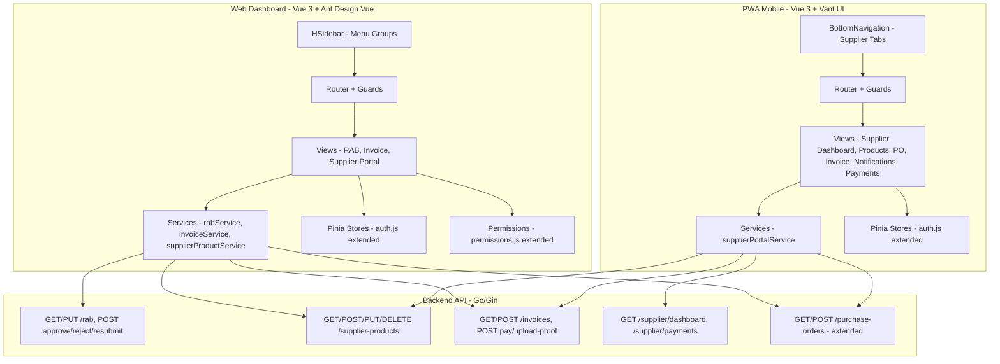
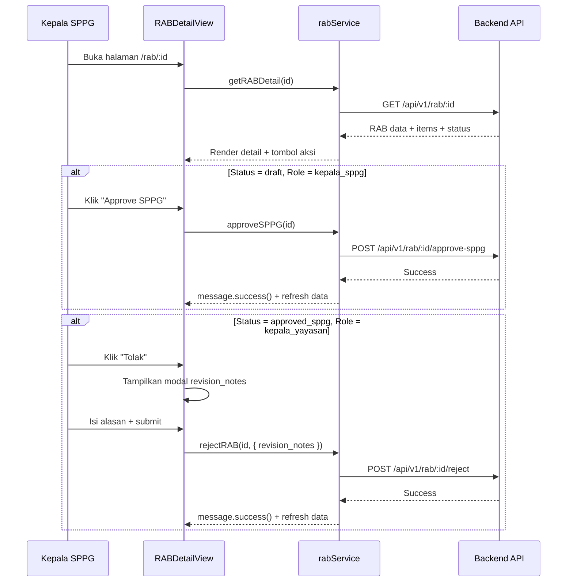
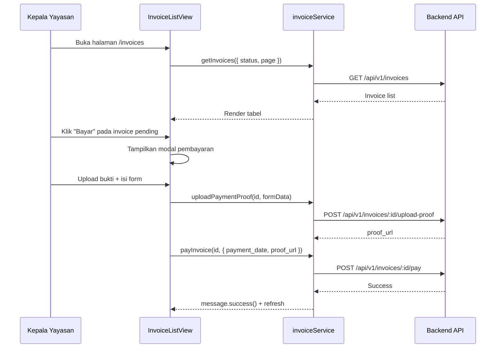
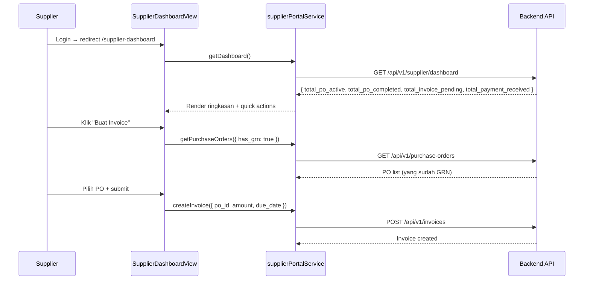

# Dokumen Desain: Frontend RAB, Procurement & Supplier Portal

## Overview

Dokumen ini mendesain implementasi frontend untuk fitur RAB (Rencana Anggaran Belanja), procurement yayasan, dan supplier portal di dua platform: Web Dashboard (`web/`) dan PWA Mobile (`pwa/`). Backend API sudah sepenuhnya diimplementasikan — frontend hanya perlu membuat service layer, views, routes, permissions, dan navigasi baru.

### Keputusan Desain Utama

1. **Service layer mengikuti pola existing** — setiap domain (RAB, SupplierProduct, Invoice, SupplierPortal) mendapat file service terpisah yang menggunakan shared axios instance dari `api.js`
2. **Satu Vue file per halaman** — mengikuti konvensi existing di `web/src/views/` dan `pwa/src/views/`
3. **Permission-based menu visibility** — sidebar dan bottom tab difilter berdasarkan role menggunakan `usePermissions` composable dan `PERMISSIONS` map
4. **Role "supplier" sebagai non-operational** — supplier tidak melihat modul operasional SPPG, hanya portal supplier-nya sendiri
5. **Shared component patterns** — menggunakan Ant Design Vue di web (a-table, a-modal, a-form, a-tag, a-statistic) dan Vant UI di PWA (van-cell, van-form, van-pull-refresh, van-swipe-cell)
6. **Format mata uang konsisten** — semua amount ditampilkan dalam format Rupiah (Rp) dengan pemisah ribuan menggunakan `Intl.NumberFormat('id-ID')`

## Architecture

### Arsitektur Tingkat Tinggi



### Alur Data: RAB Approval Flow (Web Dashboard)



### Alur Data: Invoice & Pembayaran (Web Dashboard)



### Alur Data: Supplier Portal (PWA Mobile)



## Components and Interfaces

### 1. Service Layer — Web Dashboard (`web/src/services/`)

#### rabService.js
```javascript
import api from './api'

const rabService = {
  getRABList(params = {}) { return api.get('/rab', { params }) },
  getRABDetail(id) { return api.get(`/rab/${id}`) },
  updateRAB(id, data) { return api.put(`/rab/${id}`, data) },
  approveSPPG(id) { return api.post(`/rab/${id}/approve-sppg`) },
  approveYayasan(id) { return api.post(`/rab/${id}/approve-yayasan`) },
  rejectRAB(id, data) { return api.post(`/rab/${id}/reject`, data) },
  resubmitRAB(id) { return api.post(`/rab/${id}/resubmit`) },
  getRABComparison(id) { return api.get(`/rab/${id}/comparison`) },
  getRABPOTracking(id) { return api.get(`/rab/${id}/po-tracking`) }
}
export default rabService
```

#### supplierProductService.js
```javascript
import api from './api'

const supplierProductService = {
  getProducts(params = {}) { return api.get('/supplier-products', { params }) },
  createProduct(data) { return api.post('/supplier-products', data) },
  updateProduct(id, data) { return api.put(`/supplier-products/${id}`, data) },
  deleteProduct(id) { return api.delete(`/supplier-products/${id}`) }
}
export default supplierProductService
```

#### invoiceService.js
```javascript
import api from './api'

const invoiceService = {
  getInvoices(params = {}) { return api.get('/invoices', { params }) },
  createInvoice(data) { return api.post('/invoices', data) },
  getInvoiceDetail(id) { return api.get(`/invoices/${id}`) },
  payInvoice(id, data) { return api.post(`/invoices/${id}/pay`, data) },
  uploadPaymentProof(id, formData) {
    return api.post(`/invoices/${id}/upload-proof`, formData, {
      headers: { 'Content-Type': 'multipart/form-data' }
    })
  }
}
export default invoiceService
```

### 2. Service Layer — PWA Mobile (`pwa/src/services/`)

#### supplierPortalService.js
```javascript
import api from './api'

const supplierPortalService = {
  getDashboard() { return api.get('/supplier/dashboard') },
  getPayments(params = {}) { return api.get('/supplier/payments', { params }) },
  getProducts(params = {}) { return api.get('/supplier-products', { params }) },
  createProduct(data) { return api.post('/supplier-products', data) },
  updateProduct(id, data) { return api.put(`/supplier-products/${id}`, data) },
  deleteProduct(id) { return api.delete(`/supplier-products/${id}`) },
  getInvoices(params = {}) { return api.get('/invoices', { params }) },
  createInvoice(data) { return api.post('/invoices', data) },
  getPurchaseOrders(params = {}) { return api.get('/purchase-orders', { params }) }
}
export default supplierPortalService
```

### 3. Component Tree — Web Dashboard Views

```
web/src/views/
├── RABListView.vue              # Daftar RAB (kepala_sppg, ahli_gizi, kepala_yayasan)
│   ├── a-table (rab_number, menu_plan, sppg, status, total_amount, created_at, aksi)
│   ├── a-select (filter status)
│   └── a-tag (status badge warna)
│
├── RABDetailView.vue            # Detail RAB + approval + tabs
│   ├── Header: rab_number, menu_plan, sppg, status, total_amount
│   ├── a-table (RAB items: ingredient, qty, unit, price, subtotal, supplier, status, po, grn)
│   ├── a-alert (revision_notes jika revision_requested)
│   ├── Action buttons: Approve SPPG / Approve Yayasan / Tolak / Edit / Kirim Ulang
│   ├── a-modal (rejection notes textarea)
│   ├── a-tabs
│   │   ├── Tab "PO Tracking" → tabel PO terkait + status GRN
│   │   └── Tab "Perbandingan" → tabel RAB vs Aktual
│   └── Edit inline/modal (quantity, unit_price)
│
├── InvoiceListView.vue          # Daftar Invoice (kepala_yayasan, supplier)
│   ├── a-table (invoice_number, supplier, po_number, amount, status, due_date, aksi)
│   ├── a-select (filter status)
│   └── a-modal (form pembayaran: date picker, upload bukti)
│
├── SupplierProductListView.vue  # Katalog Produk Supplier (kepala_yayasan)
│   ├── a-table (supplier_name, ingredient, unit_price, min_order_qty, stock, available)
│   ├── a-select (filter supplier, ingredient)
│   └── a-tag (status ketersediaan)
│
├── SupplierDashboardView.vue    # Dashboard Supplier (supplier)
│   ├── a-statistic / a-card (PO aktif, PO selesai, invoice pending, pembayaran)
│   ├── a-table ringkas (5 PO terbaru)
│   └── a-table ringkas (5 invoice terbaru)
│
├── SupplierProductManageView.vue # CRUD Produk Supplier (supplier)
│   ├── a-table (ingredient, price, min_qty, stock, available, aksi)
│   ├── a-modal (form tambah/edit produk)
│   └── a-popconfirm (konfirmasi hapus)
│
├── SupplierPOListView.vue       # PO List untuk Supplier (supplier, read-only)
│   ├── a-table (po_number, yayasan, target_sppg, tanggal, amount, status)
│   └── a-modal (detail PO + items)
│
└── SupplierInvoiceView.vue      # Invoice Supplier (supplier)
    ├── a-table (invoice_number, po_number, amount, status, due_date, payment)
    └── a-modal (form buat invoice: po_id picker, amount, due_date)
```

### 4. Component Tree — PWA Mobile Views

```
pwa/src/views/
├── SupplierDashboardView.vue    # Dashboard Supplier
│   ├── van-grid (ringkasan: PO aktif, PO selesai, invoice pending, pembayaran)
│   └── van-cell-group (quick actions: Lihat PO, Buat Invoice, Katalog)
│
├── SupplierProductsView.vue     # Katalog Produk Supplier
│   ├── van-cell-group + van-cell (daftar produk)
│   ├── van-swipe-cell (swipe hapus)
│   ├── van-switch (toggle ketersediaan)
│   └── FAB "Tambah Produk"
│
├── SupplierProductFormView.vue  # Form Tambah/Edit Produk
│   └── van-form (ingredient picker, unit_price, min_order_qty, stock, is_available)
│
├── SupplierPOListView.vue       # Daftar PO Supplier
│   ├── van-cell-group (po_number, yayasan, tanggal, amount, status)
│   └── van-pull-refresh
│
├── SupplierPODetailView.vue     # Detail PO
│   └── van-cell-group (PO items)
│
├── SupplierInvoiceView.vue      # Invoice Supplier
│   ├── van-cell-group (invoice list)
│   ├── van-form (buat invoice)
│   └── van-tag (status badge)
│
├── SupplierNotificationsView.vue # Notifikasi Supplier
│   ├── van-cell-group (notifikasi list)
│   └── van-badge (unread count)
│
└── SupplierPaymentsView.vue     # Riwayat Pembayaran
    ├── van-cell-group (payment list)
    ├── Total pembayaran header
    └── van-pull-refresh
```

### 5. Permission System Updates (`web/src/utils/permissions.js`)

Permission baru yang ditambahkan ke `PERMISSIONS` map:

```javascript
// RAB
RAB_VIEW: ['kepala_sppg', 'ahli_gizi', 'kepala_yayasan'],
RAB_APPROVE_SPPG: ['kepala_sppg'],
RAB_APPROVE_YAYASAN: ['kepala_yayasan'],
RAB_EDIT: ['kepala_sppg'],

// Invoice
INVOICE_VIEW: ['kepala_yayasan', 'supplier'],
INVOICE_CREATE: ['supplier'],
INVOICE_PAY: ['kepala_yayasan'],

// Supplier Product
SUPPLIER_PRODUCT_VIEW: ['kepala_yayasan', 'supplier'],
SUPPLIER_PRODUCT_MANAGE: ['supplier'],

// Supplier Portal
SUPPLIER_PORTAL_VIEW: ['supplier'],
SUPPLIER_DASHBOARD_VIEW: ['supplier'],
```

Modifikasi permission existing:
```javascript
SUPPLIER_VIEW: ['kepala_sppg', 'pengadaan', 'kepala_yayasan'],  // + kepala_yayasan
SUPPLIER_MANAGE: ['kepala_sppg', 'pengadaan', 'kepala_yayasan'], // + kepala_yayasan
PO_VIEW: ['kepala_sppg', 'pengadaan', 'kepala_yayasan'],        // + kepala_yayasan
PO_CREATE: ['kepala_sppg', 'pengadaan', 'kepala_yayasan'],      // + kepala_yayasan
```

Tambahan di `NON_OPERATIONAL_ROLES`:
```javascript
export const NON_OPERATIONAL_ROLES = ['superadmin', 'admin_bgn', 'kepala_yayasan', 'supplier']
```

Tambahan di `getRoleLabel()`:
```javascript
'supplier': 'Supplier'
```

### 6. Router Updates

#### Web Dashboard (`web/src/router/index.js`)

Route baru:
```javascript
{ path: 'rab', name: 'rab', component: () => import('@/views/RABListView.vue'),
  meta: { roles: ['kepala_sppg', 'ahli_gizi', 'kepala_yayasan'], title: 'Daftar RAB' } },
{ path: 'rab/:id', name: 'rab-detail', component: () => import('@/views/RABDetailView.vue'),
  meta: { roles: ['kepala_sppg', 'ahli_gizi', 'kepala_yayasan'], title: 'Detail RAB' } },
{ path: 'invoices', name: 'invoices', component: () => import('@/views/InvoiceListView.vue'),
  meta: { roles: ['kepala_yayasan', 'supplier'], title: 'Invoice' } },
{ path: 'supplier-products', name: 'supplier-products', component: () => import('@/views/SupplierProductListView.vue'),
  meta: { roles: ['kepala_yayasan'], title: 'Katalog Supplier' } },
{ path: 'supplier-dashboard', name: 'supplier-dashboard', component: () => import('@/views/SupplierDashboardView.vue'),
  meta: { roles: ['supplier'], title: 'Dashboard Supplier' } },
{ path: 'supplier-products/manage', name: 'supplier-products-manage', component: () => import('@/views/SupplierProductManageView.vue'),
  meta: { roles: ['supplier'], title: 'Kelola Produk' } },
{ path: 'supplier-po', name: 'supplier-po', component: () => import('@/views/SupplierPOListView.vue'),
  meta: { roles: ['supplier'], title: 'Purchase Order' } },
{ path: 'supplier-invoices', name: 'supplier-invoices', component: () => import('@/views/SupplierInvoiceView.vue'),
  meta: { roles: ['supplier'], title: 'Invoice Supplier' } },
```

Default route untuk supplier:
```javascript
case 'supplier': return '/supplier-dashboard'
```

#### PWA Mobile (`pwa/src/router/index.js`)

Route baru:
```javascript
{ path: 'supplier-dashboard', name: 'supplier-dashboard', component: () => import('@/views/SupplierDashboardView.vue'),
  meta: { roles: ['supplier'] } },
{ path: 'supplier-products', name: 'supplier-products', component: () => import('@/views/SupplierProductsView.vue'),
  meta: { roles: ['supplier'] } },
{ path: 'supplier-products/form', name: 'supplier-product-form', component: () => import('@/views/SupplierProductFormView.vue'),
  meta: { roles: ['supplier'] } },
{ path: 'supplier-products/:id/edit', name: 'supplier-product-edit', component: () => import('@/views/SupplierProductFormView.vue'),
  meta: { roles: ['supplier'] } },
{ path: 'supplier-po', name: 'supplier-po', component: () => import('@/views/SupplierPOListView.vue'),
  meta: { roles: ['supplier'] } },
{ path: 'supplier-po/:id', name: 'supplier-po-detail', component: () => import('@/views/SupplierPODetailView.vue'),
  meta: { roles: ['supplier'] } },
{ path: 'supplier-invoices', name: 'supplier-invoices', component: () => import('@/views/SupplierInvoiceView.vue'),
  meta: { roles: ['supplier'] } },
{ path: 'supplier-notifications', name: 'supplier-notifications', component: () => import('@/views/SupplierNotificationsView.vue'),
  meta: { roles: ['supplier'] } },
{ path: 'supplier-payments', name: 'supplier-payments', component: () => import('@/views/SupplierPaymentsView.vue'),
  meta: { roles: ['supplier'] } },
```

Default route untuk supplier di `getDefaultRoute()`:
```javascript
if (roleStr === 'supplier') return '/supplier-dashboard'
```

### 7. Sidebar Navigation Updates (`HSidebar.vue`)

Menu group baru ditambahkan ke `operationalMenuItems`:

```javascript
// RAB & Pengadaan — visible untuk kepala_sppg, ahli_gizi, kepala_yayasan
{
  key: 'rab-procurement',
  label: 'RAB & Pengadaan',
  emoji: '📊',
  roles: ['kepala_sppg', 'ahli_gizi', 'kepala_yayasan'],
  children: [
    { key: 'rab', label: 'Daftar RAB', emoji: '📋', route: '/rab',
      roles: ['kepala_sppg', 'ahli_gizi', 'kepala_yayasan'] },
    { key: 'invoices', label: 'Invoice', emoji: '🧾', route: '/invoices',
      roles: ['kepala_yayasan'] },
    { key: 'supplier-products-catalog', label: 'Katalog Supplier', emoji: '📦', route: '/supplier-products',
      roles: ['kepala_yayasan'] }
  ]
}

// Supplier Portal — visible hanya untuk role supplier
{
  key: 'supplier-portal',
  label: 'Supplier Portal',
  emoji: '🏪',
  roles: ['supplier'],
  children: [
    { key: 'supplier-dashboard', label: 'Dashboard', emoji: '📊', route: '/supplier-dashboard', roles: ['supplier'] },
    { key: 'supplier-products-manage', label: 'Katalog Produk', emoji: '📦', route: '/supplier-products/manage', roles: ['supplier'] },
    { key: 'supplier-po', label: 'Purchase Order', emoji: '🛍️', route: '/supplier-po', roles: ['supplier'] },
    { key: 'supplier-invoices', label: 'Invoice', emoji: '🧾', route: '/supplier-invoices', roles: ['supplier'] }
  ]
}
```

Modifikasi menu "Supply Chain" existing — tambah `kepala_yayasan` ke roles supplier:
```javascript
// Di children supply-chain:
{ key: 'suppliers', label: 'Supplier', emoji: '🏪', route: '/suppliers',
  roles: ['kepala_sppg', 'pengadaan', 'kepala_yayasan'] }  // + kepala_yayasan
```

Catatan: Menu group "RAB & Pengadaan" TIDAK ditandai `operational: true` karena kepala_yayasan (non-operational role) perlu melihatnya. Menu group "Supplier Portal" juga TIDAK ditandai `operational: true` karena supplier (non-operational role) perlu melihatnya.

### 8. Bottom Tab Navigation Updates (`BottomNavigation.vue`)

Tambah konfigurasi navigasi untuk role supplier:

```javascript
// Di NAV_CONFIG:
supplierDashboard: { name: 'supplierDashboard', label: 'Home', icon: 'wap-home-o', activeIcon: 'wap-home', route: '/supplier-dashboard' },
supplierPO: { name: 'supplierPO', label: 'PO', icon: 'orders-o', activeIcon: 'orders-o', route: '/supplier-po' },
supplierInvoice: { name: 'supplierInvoice', label: 'Invoice', icon: 'bill-o', activeIcon: 'bill-o', route: '/supplier-invoices' },
supplierNotif: { name: 'supplierNotif', label: 'Notifikasi', icon: 'bell', activeIcon: 'bell', route: '/supplier-notifications' },

// Di ROLE_NAV_MAP:
supplier: [{ left: ['supplierDashboard', 'supplierPO'], center: 'supplierInvoice', right: ['supplierNotif', 'profile'] }]
```

Badge notifikasi belum dibaca ditampilkan pada tab Notifikasi menggunakan `van-badge`.

### 9. Auth Store Updates

#### Web Dashboard (`web/src/stores/auth.js`)

```javascript
// Tambah computed properties:
const supplierId = ref(null)
const isSupplier = computed(() => role.value === 'supplier')

// Di _syncTenantFields():
supplierId.value = userData.supplier_id ?? null
```

#### PWA Mobile (`pwa/src/stores/auth.js`)

```javascript
// Tambah computed properties:
const supplierId = computed(() => user.value?.supplier_id ?? null)
const isSupplier = computed(() => userRole.value === 'supplier')
```

## Data Models

### Frontend Data Types (TypeScript-style untuk dokumentasi)

```typescript
// RAB
interface RAB {
  id: number
  rab_number: string
  menu_plan_id: number
  sppg_id: number | null
  yayasan_id: number | null
  status: 'draft' | 'approved_sppg' | 'approved_yayasan' | 'revision_requested' | 'completed'
  total_amount: number
  revision_notes: string
  approved_by_sppg: number | null
  approved_at_sppg: string | null
  approved_by_yayasan: number | null
  approved_at_yayasan: string | null
  created_by: number
  created_at: string
  updated_at: string
  menu_plan?: MenuPlan
  creator?: User
  items?: RABItem[]
}

interface RABItem {
  id: number
  rab_id: number
  ingredient_id: number
  quantity: number
  unit: string
  unit_price: number
  subtotal: number
  recommended_supplier_id: number | null
  po_id: number | null
  grn_id: number | null
  status: 'pending' | 'po_created' | 'grn_received'
  ingredient?: Ingredient
  recommended_supplier?: Supplier
}

// Invoice & Payment
interface Invoice {
  id: number
  invoice_number: string
  po_id: number
  supplier_id: number
  yayasan_id: number
  amount: number
  status: 'pending' | 'paid'
  due_date: string
  created_at: string
  purchase_order?: PurchaseOrder
  supplier?: Supplier
  payment?: Payment | null
}

interface Payment {
  id: number
  invoice_id: number
  payment_date: string
  amount: number
  proof_url: string
  payment_method: string
  paid_by: number
}

// Supplier Product
interface SupplierProduct {
  id: number
  supplier_id: number
  ingredient_id: number
  unit_price: number
  min_order_qty: number
  is_available: boolean
  stock_quantity: number
  supplier?: Supplier
  ingredient?: Ingredient
}

// Supplier Dashboard
interface SupplierDashboardData {
  total_po_active: number
  total_po_completed: number
  total_invoice_pending: number
  total_payment_received: number
  recent_pos?: PurchaseOrder[]
  recent_invoices?: Invoice[]
}
```

### Status Color Mapping

| Status | Warna a-tag (Web) | Warna van-tag (PWA) |
|---|---|---|
| draft | default (grey) | default |
| approved_sppg | blue | primary |
| approved_yayasan | green | success |
| revision_requested | orange | warning |
| completed | purple | - |
| pending (invoice) | orange | warning |
| paid (invoice) | green | success |
| pending (RAB item) | default | default |
| po_created (RAB item) | blue | primary |
| grn_received (RAB item) | green | success |


## Correctness Properties

*A property is a characteristic or behavior that should hold true across all valid executions of a system — essentially, a formal statement about what the system should do. Properties serve as the bridge between human-readable specifications and machine-verifiable correctness guarantees.*

### Property 1: Format mata uang Rupiah konsisten

*For any* bilangan non-negatif, fungsi `formatRupiah(amount)` harus menghasilkan string yang dimulai dengan "Rp", mengandung pemisah ribuan titik, dan bagian angka setelah "Rp" harus merepresentasikan nilai yang sama dengan input.

**Validates: Requirements 5.8, 7.7, 9.4**

### Property 2: Visibilitas tombol aksi RAB berdasarkan status dan role

*For any* kombinasi status RAB yang valid (draft, approved_sppg, approved_yayasan, revision_requested, completed) dan role pengguna yang valid, fungsi `getVisibleActions(status, role)` harus mengembalikan set tombol aksi yang tepat:
- (draft, kepala_sppg) → [Approve SPPG, Edit]
- (approved_sppg, kepala_yayasan) → [Approve Yayasan, Tolak]
- (revision_requested, kepala_sppg) → [Edit, Kirim Ulang]
- Semua kombinasi lain → [] (tidak ada tombol aksi approval)

**Validates: Requirements 6.3, 6.4, 6.6, 6.8**

### Property 3: Mapping status ke warna tag konsisten

*For any* status RAB yang valid atau status invoice yang valid, fungsi `getStatusColor(status)` harus mengembalikan warna tag yang terdefinisi (bukan undefined/null). Setiap status yang berbeda harus menghasilkan warna yang sesuai dengan spesifikasi desain.

**Validates: Requirements 5.5**

### Property 4: Permission map mengembalikan hasil yang benar untuk setiap pasangan role-permission

*For any* role yang valid dalam sistem dan *for any* permission key yang terdefinisi di PERMISSIONS map, fungsi `hasPermission(role, permission)` harus mengembalikan `true` jika dan hanya jika role tersebut ada dalam daftar allowed roles untuk permission tersebut.

**Validates: Requirements 16.1, 16.2, 16.3, 16.4, 16.5, 16.6**

### Property 5: Default route mapping untuk setiap role

*For any* role yang valid dalam sistem (termasuk "supplier"), fungsi `getDefaultRouteForRole(role)` (web) dan `getDefaultRoute(role)` (PWA) harus mengembalikan path route yang terdefinisi (bukan undefined) dan path tersebut harus merupakan route yang valid dalam konfigurasi router.

**Validates: Requirements 17.5, 24.3**

### Property 6: Filter RAB items pending hanya mengembalikan items tanpa PO

*For any* daftar RAB items, fungsi filter yang memilih items untuk pembuatan PO harus mengembalikan hanya items yang memiliki `po_id === null` (status "pending"). Tidak boleh ada item dengan `po_id` terisi dalam hasil filter.

**Validates: Requirements 10.4**

### Property 7: Konfigurasi navigasi bottom tab per role

*For any* role yang valid dalam sistem, `ROLE_NAV_MAP[role]` harus mengembalikan konfigurasi navigasi yang terdefinisi dengan minimal 2 item navigasi. Setiap item navigasi harus memiliki properti `name`, `label`, `icon`, dan `route` yang tidak kosong.

**Validates: Requirements 24.4**

## Error Handling

### Strategi Error Handling Frontend

1. **API Error Response** — Semua service layer menggunakan axios interceptor dari `api.js` yang sudah menangani:
   - 401 Unauthorized → redirect ke `/login` + clear auth store
   - Error lain → reject promise ke caller

2. **Component-Level Error Handling** — Setiap view menangani error dari service call:
   - `message.error(error.response?.data?.message || 'Terjadi kesalahan')` (Ant Design Vue)
   - `showToast(error.response?.data?.message || 'Terjadi kesalahan')` (Vant UI)

3. **Specific Backend Error Codes** — Mapping error code ke pesan user-friendly:

| Error Code | Pesan untuk User |
|---|---|
| `RAB_NOT_FOUND` | "RAB tidak ditemukan" |
| `RAB_INVALID_STATUS` | "Status RAB tidak valid untuk operasi ini" |
| `RAB_NOT_EDITABLE` | "RAB tidak dapat diedit saat ini" |
| `RAB_NOT_APPROVABLE` | "RAB tidak dapat disetujui dari status saat ini" |
| `SUPPLIER_PRODUCT_NOT_FOUND` | "Produk tidak ditemukan" |
| `DUPLICATE_SUPPLIER_PRODUCT` | "Produk untuk ingredient ini sudah ada" |
| `INVOICE_NOT_FOUND` | "Invoice tidak ditemukan" |
| `INVOICE_ALREADY_PAID` | "Invoice sudah dibayar" |
| `INVOICE_AMOUNT_MISMATCH` | "Jumlah invoice tidak sesuai dengan PO" |
| `GRN_NOT_COMPLETED` | "GRN belum selesai untuk PO ini" |
| `SUPPLIER_NOT_LINKED` | "Supplier tidak terhubung dengan yayasan" |
| `PO_ALREADY_HAS_GRN` | "PO ini sudah memiliki GRN" |
| `RAB_NOT_APPROVED` | "RAB belum disetujui yayasan" |

4. **Loading States** — Setiap view menggunakan `ref(false)` untuk loading state:
   - Web: `a-table` loading prop, `a-button` loading prop, `a-spin`
   - PWA: `van-loading`, `van-pull-refresh` loading prop

5. **Empty States** — Tampilkan pesan ketika data kosong:
   - Web: `a-empty` component
   - PWA: Vant empty state

6. **File Upload Error** — Upload bukti pembayaran:
   - Validasi ukuran file (max 5MB) dan tipe file (image/pdf) di frontend sebelum upload
   - Tampilkan progress upload
   - Retry mechanism jika upload gagal

7. **Optimistic UI** — Tidak digunakan untuk operasi approval/payment karena memerlukan konfirmasi server. Semua operasi menunggu response API sebelum update UI.

## Testing Strategy

### Unit Testing (Vitest)

Unit tests fokus pada:

**Service Layer Tests:**
- Setiap method di `rabService`, `supplierProductService`, `invoiceService`, `supplierPortalService` ditest untuk memverifikasi URL, HTTP method, dan parameter yang benar
- Mock axios instance untuk isolasi

**Utility Function Tests:**
- `formatRupiah()` — beberapa contoh spesifik (0, 1000, 1500000, dll)
- `getStatusColor()` — setiap status menghasilkan warna yang benar
- `getVisibleActions()` — beberapa kombinasi (status, role) spesifik
- `hasPermission()` — beberapa contoh spesifik untuk permission baru

**Store Tests:**
- Auth store: `supplierId` dan `isSupplier` computed properties
- Verify `_syncTenantFields` menghandle `supplier_id`

**Router Tests:**
- Verify route definitions exist dengan meta.roles yang benar
- Verify `getDefaultRouteForRole('supplier')` mengembalikan path yang benar

### Property-Based Testing (fast-check)

Library: [fast-check](https://github.com/dubzzz/fast-check) — property-based testing library untuk JavaScript/TypeScript.

Setiap property test harus:
- Minimum 100 iterasi per test
- Tag dengan komentar referensi ke property di design document
- Format tag: `Feature: rab-procurement-frontend, Property {number}: {title}`

Property tests yang diimplementasikan:

1. **formatRupiah** — Generate bilangan non-negatif acak, verifikasi output dimulai dengan "Rp" dan merepresentasikan nilai yang sama
2. **getVisibleActions** — Generate kombinasi (status, role) acak dari enum yang valid, verifikasi output sesuai spesifikasi
3. **getStatusColor** — Generate status acak dari enum yang valid, verifikasi output bukan undefined/null
4. **hasPermission** — Generate pasangan (role, permission) acak, verifikasi konsistensi dengan PERMISSIONS map
5. **getDefaultRouteForRole** — Generate role acak, verifikasi output adalah string path yang valid
6. **filterPendingRABItems** — Generate daftar RAB items acak dengan berbagai po_id (null/non-null), verifikasi filter hanya mengembalikan items dengan po_id null
7. **ROLE_NAV_MAP** — Generate role acak, verifikasi konfigurasi navigasi memiliki properti yang lengkap

### Component Testing (Vitest + Vue Test Utils)

Component tests fokus pada:
- RABDetailView: tombol aksi muncul/hilang berdasarkan status dan role
- InvoiceListView: modal pembayaran muncul saat klik "Bayar"
- SupplierProductManageView: CRUD flow (tambah, edit, hapus)
- Error message ditampilkan saat API gagal
- Loading state ditampilkan saat menunggu API

### Integration Testing

Integration tests fokus pada:
- Router navigation guard: role "supplier" tidak bisa akses `/rab`, role "kepala_sppg" tidak bisa akses `/supplier-dashboard`
- Sidebar menu visibility: role "supplier" hanya melihat menu Supplier Portal
- FCM push notification registration untuk role supplier (PWA)
- End-to-end flow: login supplier → dashboard → lihat PO → buat invoice
