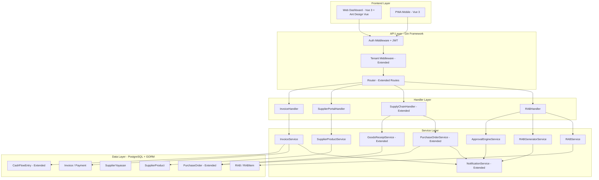
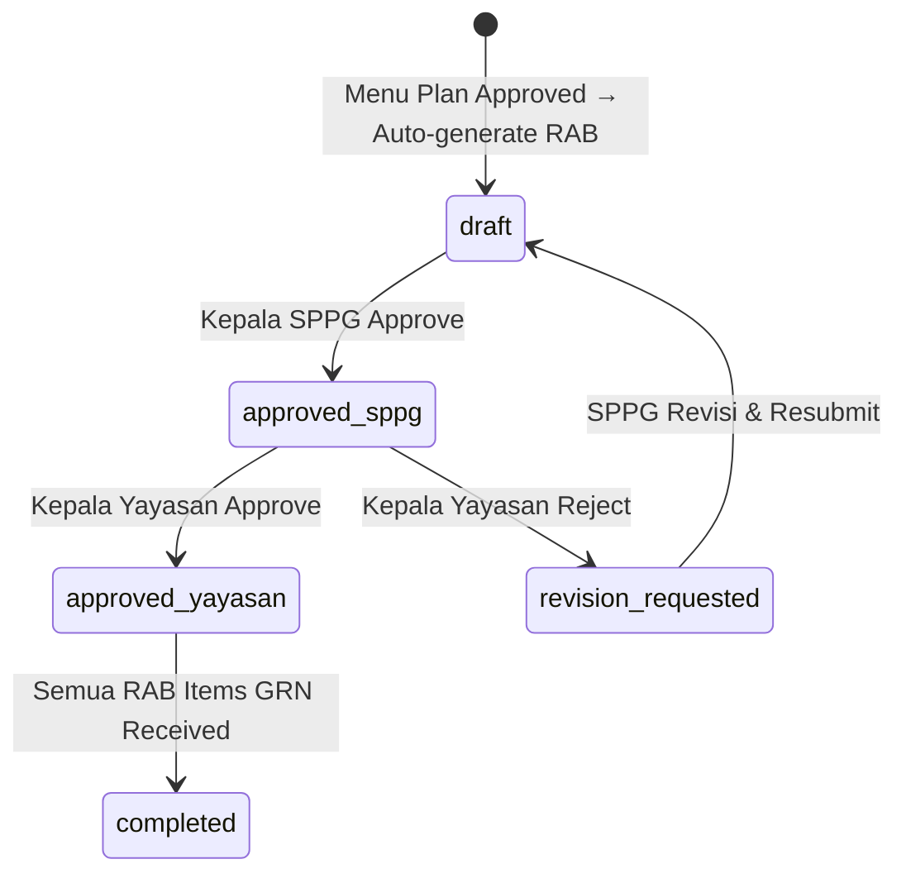
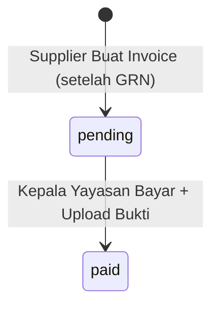
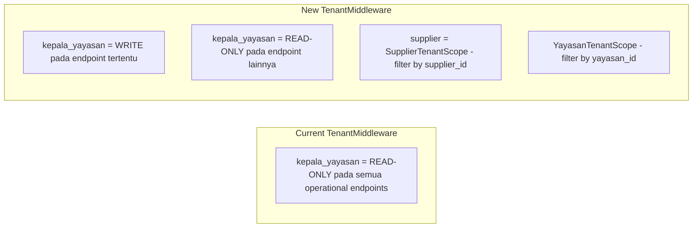

# Dokumen Desain: RAB, Procurement Yayasan & Supplier Portal

## Overview

Dokumen ini mendesain perubahan arsitektur dan implementasi untuk fitur RAB (Rencana Anggaran Belanja), procurement terpusat di level yayasan, dan portal supplier baru. Fitur ini mengubah alur pengadaan dari SPPG-level menjadi yayasan-level, menambahkan auto-generasi RAB dari menu plan, alur persetujuan multi-level, dan portal supplier dengan katalog produk, notifikasi, serta invoice.

### Keputusan Desain Utama

1. **Supplier menjadi entitas yayasan-level** via junction table `SupplierYayasan` (many-to-many), bukan lagi SPPG-level
2. **1 PO = 1 SPPG target** karena GRN terjadi di SPPG — PO harus punya `target_sppg_id`
3. **1 PO = 1 GRN** (tidak ada partial delivery) — relasi 1:1 ketat
4. **RAB auto-generated** saat menu plan di-approve — menggunakan recipe items untuk menghitung kebutuhan bahan baku
5. **Harga RAB dari supplier catalog** — algoritma: termurah + quality_rating tertinggi
6. **Role "supplier" baru** dengan JWT claims `supplier_id` dan entity-scoped isolation
7. **kepala_yayasan mendapat izin tulis** pada endpoint tertentu (supplier, PO, RAB approval, invoice payment)
8. **Pembayaran manual** (bank transfer + upload bukti) — bukan payment gateway

## Architecture

### Arsitektur Tingkat Tinggi



### Alur Status RAB (State Machine)



### Alur Invoice & Pembayaran



### Perubahan Tenant Middleware



## Components and Interfaces

### 1. RABGeneratorService

Bertanggung jawab membuat RAB secara otomatis dari menu plan yang di-approve.

```go
type RABGeneratorService struct {
    db    *gorm.DB
    notif *NotificationService
}

// GenerateRABFromMenuPlan dipanggil saat menu plan di-approve
// 1. Ambil semua recipe items dari menu plan
// 2. Agregasi kebutuhan ingredient (quantity per ingredient)
// 3. Untuk setiap ingredient, cari SupplierProduct termurah + quality terbaik
// 4. Buat RAB + RABItems
// 5. Kirim notifikasi ke kepala_sppg
func (s *RABGeneratorService) GenerateRABFromMenuPlan(menuPlanID uint, createdBy uint) (*RAB, error)

// RecommendSupplier mencari supplier terbaik untuk ingredient tertentu
// Algoritma: filter is_available=true, sort by unit_price ASC, quality_rating DESC
// Return: supplier_id, unit_price (atau nil, 0 jika tidak ada)
func (s *RABGeneratorService) RecommendSupplier(ingredientID uint, yayasanID uint) (*uint, float64)

// AggregateIngredients menghitung total kebutuhan per ingredient dari menu plan
// Traverse: MenuPlan → MenuItems → Recipe → RecipeItems → SemiFinishedGoods → SFGRecipeIngredients
func (s *RABGeneratorService) AggregateIngredients(menuPlanID uint) ([]IngredientRequirement, error)
```

### 2. ApprovalEngineService

Mengelola alur persetujuan multi-level RAB.

```go
type ApprovalEngineService struct {
    db    *gorm.DB
    notif *NotificationService
}

// ApproveByKepalaSPPG: draft → approved_sppg
func (s *ApprovalEngineService) ApproveByKepalaSPPG(rabID uint, userID uint) error

// ApproveByKepalaYayasan: approved_sppg → approved_yayasan
func (s *ApprovalEngineService) ApproveByKepalaYayasan(rabID uint, userID uint) error

// RejectByKepalaYayasan: approved_sppg → revision_requested
func (s *ApprovalEngineService) RejectByKepalaYayasan(rabID uint, userID uint, notes string) error

// ResubmitRAB: revision_requested → draft (setelah revisi)
func (s *ApprovalEngineService) ResubmitRAB(rabID uint, userID uint) error

// createAuditTrail: catat setiap perubahan status
func (s *ApprovalEngineService) createAuditTrail(rabID uint, userID uint, fromStatus, toStatus, notes string) error
```

### 3. SupplierProductService

CRUD untuk katalog produk supplier.

```go
type SupplierProductService struct {
    db *gorm.DB
}

func (s *SupplierProductService) CreateProduct(product *SupplierProduct) error
func (s *SupplierProductService) UpdateProduct(id uint, updates *SupplierProduct) error
func (s *SupplierProductService) GetProductsBySupplier(supplierID uint) ([]SupplierProduct, error)
func (s *SupplierProductService) GetCatalogByYayasan(yayasanID uint) ([]SupplierProduct, error)
func (s *SupplierProductService) ToggleAvailability(id uint, isAvailable bool) error
```

### 4. InvoiceService

Mengelola invoice dan pembayaran.

```go
type InvoiceService struct {
    db          *gorm.DB
    cashFlow    *CashFlowService
    notif       *NotificationService
}

// CreateInvoice: supplier buat invoice setelah GRN selesai
// Validasi: PO harus punya GRN, amount harus = PO total_amount
func (s *InvoiceService) CreateInvoice(invoice *Invoice) error

// ProcessPayment: kepala_yayasan bayar invoice
// 1. Validasi invoice status = "pending"
// 2. Simpan payment record
// 3. Update invoice status → "paid"
// 4. Buat CashFlowEntry (category="pengadaan", type="expense")
// 5. Kirim notifikasi ke supplier
func (s *InvoiceService) ProcessPayment(invoiceID uint, payment *Payment) error
```

### 5. Extended PurchaseOrderService

Perubahan pada PO service existing.

```go
// Perubahan pada CreatePurchaseOrder:
// - Tambah validasi: RAB harus berstatus "approved_yayasan"
// - Tambah validasi: supplier harus terhubung dengan yayasan via SupplierYayasan
// - Tambah field: yayasan_id, rab_id, target_sppg_id
// - Update RABItem.po_id setelah PO dibuat
// - Kirim notifikasi ke supplier DAN ke kepala_sppg SPPG target (agar SPPG tahu supplier mana yang akan datang)

// Perubahan pada GoodsReceiptService.CreateGoodsReceipt:
// - Validasi 1:1 PO-GRN (tolak jika PO sudah punya GRN)
// - Update RABItem.grn_id setelah GRN dibuat
// - Cek apakah semua RABItem sudah grn_received → auto-complete RAB
// - Update supplier quality_rating average
```

### 6. Extended TenantMiddleware

```go
// Perubahan pada TenantMiddleware:
// - Tambah case "supplier" → set SupplierTenantScope
// - Modifikasi case "kepala_yayasan" → izinkan write pada whitelist endpoints

// yayasanWriteWhitelist: endpoint yang boleh ditulis oleh kepala_yayasan
var yayasanWriteWhitelist = []string{
    "/api/v1/suppliers",
    "/api/v1/purchase-orders",
    "/api/v1/rab",
    "/api/v1/invoices",
}

// SupplierTenantScope: filter berdasarkan supplier_id dari JWT
func SupplierTenantScope(c *gin.Context) func(db *gorm.DB) *gorm.DB

// YayasanTenantScope: filter berdasarkan yayasan_id (untuk entitas yayasan-owned)
func YayasanTenantScope(c *gin.Context) func(db *gorm.DB) *gorm.DB
```

### 7. API Endpoints Baru

```
# RAB Management
GET    /api/v1/rab                          # List RAB (scoped)
GET    /api/v1/rab/:id                       # Detail RAB + items + status
POST   /api/v1/rab/:id/approve-sppg          # Kepala SPPG approve
POST   /api/v1/rab/:id/approve-yayasan       # Kepala Yayasan approve
POST   /api/v1/rab/:id/reject                # Kepala Yayasan reject
POST   /api/v1/rab/:id/resubmit              # SPPG resubmit setelah revisi
PUT    /api/v1/rab/:id                       # Edit RAB (hanya draft/revision_requested)
GET    /api/v1/rab/:id/comparison            # RAB vs Aktual
GET    /api/v1/rab/:id/po-tracking           # PO tracking untuk SPPG (PO list + supplier + GRN status)

# Supplier Product Catalog
GET    /api/v1/supplier-products              # List produk (supplier: miliknya, yayasan: semua linked)
POST   /api/v1/supplier-products              # Supplier buat produk
PUT    /api/v1/supplier-products/:id          # Supplier update produk
DELETE /api/v1/supplier-products/:id          # Supplier hapus produk

# Invoice & Payment
GET    /api/v1/invoices                       # List invoice (scoped)
POST   /api/v1/invoices                       # Supplier buat invoice
GET    /api/v1/invoices/:id                   # Detail invoice
POST   /api/v1/invoices/:id/pay               # Kepala Yayasan bayar
POST   /api/v1/invoices/:id/upload-proof      # Upload bukti transfer

# Supplier Dashboard
GET    /api/v1/supplier/dashboard             # Dashboard ringkasan supplier
GET    /api/v1/supplier/payments              # Riwayat pembayaran yang diterima supplier
```

## Data Models

### Model Baru

```go
// RAB - Rencana Anggaran Belanja
type RAB struct {
    ID            uint       `gorm:"primaryKey" json:"id"`
    RABNumber     string     `gorm:"uniqueIndex;size:50;not null" json:"rab_number"`
    MenuPlanID    uint       `gorm:"index;not null" json:"menu_plan_id"`
    SPPGID        *uint      `gorm:"index" json:"sppg_id"`
    YayasanID     *uint      `gorm:"index" json:"yayasan_id"`
    Status        string     `gorm:"size:30;not null;index" json:"status"` // draft, approved_sppg, approved_yayasan, revision_requested, completed
    TotalAmount   float64    `gorm:"not null" json:"total_amount"`
    RevisionNotes string     `gorm:"type:text" json:"revision_notes"`
    ApprovedBySPPG   *uint   `gorm:"index" json:"approved_by_sppg"`
    ApprovedAtSPPG   *time.Time `json:"approved_at_sppg"`
    ApprovedByYayasan *uint  `gorm:"index" json:"approved_by_yayasan"`
    ApprovedAtYayasan *time.Time `json:"approved_at_yayasan"`
    CreatedBy     uint       `gorm:"not null;index" json:"created_by"`
    CreatedAt     time.Time  `json:"created_at"`
    UpdatedAt     time.Time  `json:"updated_at"`
    MenuPlan      MenuPlan   `gorm:"foreignKey:MenuPlanID" json:"menu_plan,omitempty"`
    Creator       User       `gorm:"foreignKey:CreatedBy" json:"creator,omitempty"`
    Items         []RABItem  `gorm:"foreignKey:RABID" json:"items,omitempty"`
}

// RABItem - Baris item dalam RAB
type RABItem struct {
    ID                    uint        `gorm:"primaryKey" json:"id"`
    RABID                 uint        `gorm:"index;not null" json:"rab_id"`
    IngredientID          uint        `gorm:"index;not null" json:"ingredient_id"`
    Quantity              float64     `gorm:"not null" json:"quantity"`
    Unit                  string      `gorm:"size:20;not null" json:"unit"`
    UnitPrice             float64     `gorm:"not null" json:"unit_price"`
    Subtotal              float64     `gorm:"not null" json:"subtotal"`
    RecommendedSupplierID *uint       `gorm:"index" json:"recommended_supplier_id"`
    POID                  *uint       `gorm:"index" json:"po_id"`
    GRNID                 *uint       `gorm:"index" json:"grn_id"`
    Status                string      `gorm:"size:20;not null;index" json:"status"` // pending, po_created, grn_received
    CreatedAt             time.Time   `json:"created_at"`
    UpdatedAt             time.Time   `json:"updated_at"`
    RAB                   RAB         `gorm:"foreignKey:RABID" json:"rab,omitempty"`
    Ingredient            Ingredient  `gorm:"foreignKey:IngredientID" json:"ingredient,omitempty"`
    RecommendedSupplier   *Supplier   `gorm:"foreignKey:RecommendedSupplierID" json:"recommended_supplier,omitempty"`
}

// SupplierProduct - Katalog produk supplier
type SupplierProduct struct {
    ID            uint       `gorm:"primaryKey" json:"id"`
    SupplierID    uint       `gorm:"uniqueIndex:idx_supplier_ingredient;not null" json:"supplier_id"`
    IngredientID  uint       `gorm:"uniqueIndex:idx_supplier_ingredient;not null" json:"ingredient_id"`
    UnitPrice     float64    `gorm:"not null" json:"unit_price"`
    MinOrderQty   float64    `gorm:"default:0" json:"min_order_qty"`
    IsAvailable   bool       `gorm:"default:true;index" json:"is_available"`
    StockQuantity float64    `gorm:"default:0" json:"stock_quantity"`
    CreatedAt     time.Time  `json:"created_at"`
    UpdatedAt     time.Time  `json:"updated_at"`
    Supplier      Supplier   `gorm:"foreignKey:SupplierID" json:"supplier,omitempty"`
    Ingredient    Ingredient `gorm:"foreignKey:IngredientID" json:"ingredient,omitempty"`
}

// SupplierYayasan - Junction table supplier-yayasan
type SupplierYayasan struct {
    ID         uint      `gorm:"primaryKey" json:"id"`
    SupplierID uint      `gorm:"uniqueIndex:idx_supplier_yayasan;not null" json:"supplier_id"`
    YayasanID  uint      `gorm:"uniqueIndex:idx_supplier_yayasan;not null" json:"yayasan_id"`
    CreatedAt  time.Time `json:"created_at"`
    Supplier   Supplier  `gorm:"foreignKey:SupplierID" json:"supplier,omitempty"`
    Yayasan    Yayasan   `gorm:"foreignKey:YayasanID" json:"yayasan,omitempty"`
}

// Invoice - Faktur dari supplier
type Invoice struct {
    ID            uint       `gorm:"primaryKey" json:"id"`
    InvoiceNumber string     `gorm:"uniqueIndex;size:50;not null" json:"invoice_number"`
    POID          uint       `gorm:"index;not null" json:"po_id"`
    SupplierID    uint       `gorm:"index;not null" json:"supplier_id"`
    YayasanID     uint       `gorm:"index;not null" json:"yayasan_id"`
    Amount        float64    `gorm:"not null" json:"amount"`
    Status        string     `gorm:"size:20;not null;index" json:"status"` // pending, paid
    DueDate       time.Time  `gorm:"index" json:"due_date"`
    CreatedAt     time.Time  `json:"created_at"`
    UpdatedAt     time.Time  `json:"updated_at"`
    PurchaseOrder PurchaseOrder `gorm:"foreignKey:POID" json:"purchase_order,omitempty"`
    Supplier      Supplier   `gorm:"foreignKey:SupplierID" json:"supplier,omitempty"`
    Payment       *Payment   `gorm:"foreignKey:InvoiceID" json:"payment,omitempty"`
}

// Payment - Pembayaran invoice
type Payment struct {
    ID            uint      `gorm:"primaryKey" json:"id"`
    InvoiceID     uint      `gorm:"uniqueIndex;not null" json:"invoice_id"`
    PaymentDate   time.Time `gorm:"index;not null" json:"payment_date"`
    Amount        float64   `gorm:"not null" json:"amount"`
    ProofURL      string    `gorm:"size:500" json:"proof_url"`
    PaymentMethod string    `gorm:"size:50;not null" json:"payment_method"` // bank_transfer
    PaidBy        uint      `gorm:"not null;index" json:"paid_by"`
    CreatedAt     time.Time `json:"created_at"`
    Invoice       Invoice   `gorm:"foreignKey:InvoiceID" json:"invoice,omitempty"`
    Payer         User      `gorm:"foreignKey:PaidBy" json:"payer,omitempty"`
}
```

### Modifikasi Model Existing

```go
// PurchaseOrder - Tambah field baru
type PurchaseOrder struct {
    // ... field existing tetap ...
    YayasanID     *uint  `gorm:"index" json:"yayasan_id"`      // NEW
    RABID         *uint  `gorm:"index" json:"rab_id"`           // NEW
    TargetSPPGID  *uint  `gorm:"index" json:"target_sppg_id"`   // NEW
}

// User - Tambah role "supplier" dan field SupplierID
type User struct {
    // ... field existing tetap ...
    // Role enum diperluas: tambah "supplier"
    // Role validate tag: oneof=... supplier
    SupplierID *uint `gorm:"index" json:"supplier_id"` // NEW - untuk role supplier
}

// JWTClaims - Tambah SupplierID
type JWTClaims struct {
    // ... field existing tetap ...
    SupplierID *uint `json:"supplier_id,omitempty"` // NEW
}

// CashFlowEntry - Tambah category "pengadaan" dan YayasanID
type CashFlowEntry struct {
    // ... field existing tetap ...
    YayasanID *uint `gorm:"index" json:"yayasan_id"` // NEW
    // Category enum diperluas: tambah "pengadaan"
}

// Supplier - sppg_id menjadi nullable (backward compat), tambah relasi
type Supplier struct {
    // ... field existing tetap, sppg_id sudah nullable ...
    Yayasans []Yayasan `gorm:"many2many:supplier_yayasans" json:"yayasans,omitempty"` // NEW
}
```

### ERD Relasi Baru

```mermaid
erDiagram
    MenuPlan ||--o| RAB : "generates"
    RAB ||--|{ RABItem : "contains"
    RABItem }|--|| Ingredient : "references"
    RABItem }o--o| Supplier : "recommended"
    RABItem }o--o| PurchaseOrder : "linked via po_id"
    RABItem }o--o| GoodsReceipt : "linked via grn_id"
    
    Supplier }|--|{ SupplierYayasan : "linked"
    Yayasan }|--|{ SupplierYayasan : "linked"
    
    Supplier ||--|{ SupplierProduct : "offers"
    SupplierProduct }|--|| Ingredient : "for"
    
    PurchaseOrder }|--|| Supplier : "to"
    PurchaseOrder }|--|| RAB : "from"
    PurchaseOrder ||--o| GoodsReceipt : "1:1"
    PurchaseOrder ||--o| Invoice : "billed by"
    
    Invoice ||--o| Payment : "paid via"
    Invoice }|--|| Supplier : "from"
    Invoice }|--|| Yayasan : "to"
    
    Payment --> CashFlowEntry : "creates"
```


## Correctness Properties

*A property is a characteristic or behavior that should hold true across all valid executions of a system — essentially, a formal statement about what the system should do. Properties serve as the bridge between human-readable specifications and machine-verifiable correctness guarantees.*

### Property 1: Agregasi ingredient dari menu plan menghasilkan total yang benar

*For any* menu plan dengan recipe items, total kuantitas per ingredient dalam RAB harus sama dengan jumlah kuantitas ingredient tersebut di semua recipe items dalam menu plan (dikalikan jumlah porsi).

**Validates: Requirements 1.2**

### Property 2: Rekomendasi supplier memilih harga termurah dengan quality terbaik

*For any* set of SupplierProduct yang tersedia untuk suatu ingredient dalam yayasan tertentu, RAB_Generator harus merekomendasikan supplier dengan `unit_price` terendah. Jika ada beberapa supplier dengan harga sama, pilih yang `quality_rating` tertinggi.

**Validates: Requirements 1.3**

### Property 3: Integritas data RAB dan RAB_Item

*For any* RAB yang dibuat, `rab_number` harus sesuai format `RAB-YYYYMMDD-XXXX`, status harus "draft", dan `total_amount` harus sama dengan jumlah semua `subtotal` dari RAB_Item. *For any* RAB_Item, `subtotal` harus sama dengan `quantity * unit_price`.

**Validates: Requirements 1.4, 1.5**

### Property 4: State machine RAB mengikuti transisi yang valid

*For any* RAB, transisi status hanya boleh mengikuti jalur yang valid: draft → approved_sppg → approved_yayasan → completed, atau approved_sppg → revision_requested → draft. Transisi di luar jalur ini harus ditolak.

**Validates: Requirements 2.1, 2.2, 2.3**

### Property 5: Audit trail tercatat pada setiap perubahan status RAB

*For any* perubahan status RAB, sistem harus membuat record audit trail yang berisi `user_id`, `timestamp`, `from_status`, `to_status`, dan `notes` yang benar.

**Validates: Requirements 2.5**

### Property 6: Izin edit RAB berdasarkan status

*For any* RAB, operasi edit hanya boleh berhasil jika status RAB adalah "draft" atau "revision_requested". Operasi edit pada RAB dengan status lain ("approved_sppg", "approved_yayasan", "completed") harus ditolak.

**Validates: Requirements 2.6, 2.7**

### Property 7: Supplier many-to-many dengan yayasan

*For any* supplier, supplier tersebut dapat terhubung dengan beberapa yayasan melalui SupplierYayasan, dan setiap relasi harus unik (tidak ada duplikat supplier_id + yayasan_id).

**Validates: Requirements 3.2**

### Property 8: Pembuatan supplier oleh kepala_yayasan membuat junction record

*For any* supplier yang dibuat oleh kepala_yayasan, sistem harus membuat record SupplierYayasan yang menghubungkan supplier tersebut dengan yayasan milik kepala_yayasan.

**Validates: Requirements 3.3**

### Property 9: YayasanTenantScope memfilter data dengan benar

*For any* query yang menggunakan YayasanTenantScope dengan yayasan_id tertentu, semua hasil yang dikembalikan harus terhubung dengan yayasan tersebut. Tidak boleh ada data dari yayasan lain yang bocor.

**Validates: Requirements 3.4, 5.8, 10.1**

### Property 10: Migrasi supplier memetakan ke yayasan yang benar

*For any* supplier existing dengan sppg_id, migrasi harus membuat SupplierYayasan record yang menghubungkan supplier ke yayasan berdasarkan `sppg.yayasan_id` dari SPPG terkait.

**Validates: Requirements 3.6, 11.3**

### Property 11: Validasi ingredient pada SupplierProduct

*For any* SupplierProduct yang dibuat atau diupdate, `ingredient_id` harus merujuk ke Ingredient yang valid (ada di database). Jika tidak valid, operasi harus ditolak.

**Validates: Requirements 4.2**

### Property 12: Unique constraint pada SupplierProduct (supplier_id, ingredient_id)

*For any* supplier, tidak boleh ada dua SupplierProduct dengan `ingredient_id` yang sama. Percobaan membuat duplikat harus ditolak.

**Validates: Requirements 4.3**

### Property 13: Isolasi data supplier (SupplierTenantScope)

*For any* user dengan role "supplier", query data hanya boleh mengembalikan data yang terhubung dengan `supplier_id` miliknya. Data supplier lain tidak boleh terlihat.

**Validates: Requirements 4.5, 6.4, 10.3**

### Property 14: PO hanya bisa dibuat dari RAB yang approved_yayasan

*For any* percobaan membuat PO, sistem harus memvalidasi bahwa RAB terkait berstatus "approved_yayasan". PO dari RAB dengan status lain harus ditolak.

**Validates: Requirements 5.1**

### Property 15: Validasi supplier-yayasan pada pembuatan PO

*For any* PO yang dibuat, `supplier_id` harus terhubung dengan yayasan pembuat PO melalui SupplierYayasan. PO dengan supplier yang tidak terhubung harus ditolak.

**Validates: Requirements 5.4**

### Property 16: RAB_Item diupdate dengan po_id saat PO dibuat

*For any* PO yang berhasil dibuat, semua RAB_Item yang tercakup dalam PO tersebut harus memiliki `po_id` yang terisi dengan ID PO yang baru dibuat.

**Validates: Requirements 5.5**

### Property 17: Relasi 1:1 antara PO dan GRN

*For any* PO, hanya boleh ada maksimal satu GRN. Percobaan membuat GRN kedua untuk PO yang sudah memiliki GRN harus ditolak.

**Validates: Requirements 8.2, 8.3**

### Property 18: RAB_Item diupdate dengan grn_id saat GRN dibuat

*For any* GRN yang berhasil dibuat, RAB_Item yang terhubung melalui PO harus memiliki `grn_id` yang terisi dengan ID GRN yang baru dibuat.

**Validates: Requirements 8.4**

### Property 19: Quality rating dalam range valid dan rata-rata supplier terupdate

*For any* GRN dengan quality_rating, nilai harus antara 1-5. Setelah GRN dibuat, rata-rata `quality_rating` pada Supplier harus dihitung ulang dengan benar berdasarkan semua GRN terkait.

**Validates: Requirements 8.6, 8.7**

### Property 20: Derivasi status RAB_Item berdasarkan po_id dan grn_id

*For any* RAB_Item, status harus "pending" jika `po_id` NULL, "po_created" jika `po_id` terisi tapi `grn_id` NULL, dan "grn_received" jika `grn_id` terisi. Tidak ada kombinasi lain yang valid.

**Validates: Requirements 12.2, 8.8**

### Property 21: Invoice hanya bisa dibuat setelah GRN selesai

*For any* percobaan membuat invoice, PO terkait harus sudah memiliki GRN (status "received"). Invoice untuk PO tanpa GRN harus ditolak.

**Validates: Requirements 9.1**

### Property 22: Amount invoice harus sesuai dengan total PO

*For any* invoice yang dibuat, `amount` harus sama dengan `total_amount` pada PO terkait. Invoice dengan amount yang berbeda harus ditolak.

**Validates: Requirements 9.3**

### Property 23: Pembayaran mengubah status invoice dan membuat CashFlowEntry

*For any* pembayaran yang berhasil, status invoice harus berubah menjadi "paid" dan CashFlowEntry baru harus dibuat dengan `category="pengadaan"`, `type="expense"`, dan `amount` yang sesuai.

**Validates: Requirements 9.7**

### Property 24: Pembayaran duplikat ditolak

*For any* invoice yang sudah berstatus "paid", percobaan pembayaran ulang harus ditolak. Tidak boleh ada dua Payment record untuk satu invoice.

**Validates: Requirements 9.9**

### Property 25: Ringkasan RAB menghitung dengan benar

*For any* RAB, ringkasan harus menghitung: total_items = jumlah RAB_Item, items_with_po = jumlah RAB_Item dengan po_id terisi, items_received = jumlah RAB_Item dengan grn_id terisi, total_budget = sum(subtotal), total_spent = sum(actual amount dari GRN terkait).

**Validates: Requirements 12.3**

### Property 26: RAB auto-complete saat semua item diterima

*For any* RAB, jika semua RAB_Item memiliki status "grn_received" (grn_id terisi), status RAB harus otomatis berubah menjadi "completed".

**Validates: Requirements 12.4**

### Property 27: Supplier endpoint restriction untuk role supplier

*For any* user dengan role "supplier" yang mengakses endpoint di luar izinnya (selain supplier catalog, PO list read-only, invoice, notifikasi, dashboard), sistem harus mengembalikan HTTP 403 Forbidden.

**Validates: Requirements 10.4, 10.6**

## Error Handling

### Error Codes Baru

| Service Error | HTTP | Error Code | Deskripsi |
|---|---|---|---|
| `ErrRABNotFound` | 404 | `RAB_NOT_FOUND` | RAB tidak ditemukan |
| `ErrRABInvalidStatus` | 400 | `RAB_INVALID_STATUS` | Status RAB tidak valid untuk operasi ini |
| `ErrRABNotEditable` | 400 | `RAB_NOT_EDITABLE` | RAB tidak dapat diedit (status bukan draft/revision_requested) |
| `ErrRABNotApprovable` | 400 | `RAB_NOT_APPROVABLE` | RAB tidak dapat disetujui dari status saat ini |
| `ErrSupplierProductNotFound` | 404 | `SUPPLIER_PRODUCT_NOT_FOUND` | Produk supplier tidak ditemukan |
| `ErrDuplicateSupplierProduct` | 400 | `DUPLICATE_SUPPLIER_PRODUCT` | Produk supplier sudah ada untuk ingredient ini |
| `ErrInvalidIngredient` | 400 | `INVALID_INGREDIENT` | Ingredient tidak valid |
| `ErrInvoiceNotFound` | 404 | `INVOICE_NOT_FOUND` | Invoice tidak ditemukan |
| `ErrInvoiceAlreadyPaid` | 400 | `INVOICE_ALREADY_PAID` | Invoice sudah dibayar |
| `ErrInvoiceAmountMismatch` | 400 | `INVOICE_AMOUNT_MISMATCH` | Amount invoice tidak sesuai dengan PO |
| `ErrGRNNotCompleted` | 400 | `GRN_NOT_COMPLETED` | GRN belum selesai untuk PO ini |
| `ErrSupplierNotLinked` | 400 | `SUPPLIER_NOT_LINKED` | Supplier tidak terhubung dengan yayasan |
| `ErrPOAlreadyHasGRN` | 400 | `PO_ALREADY_HAS_GRN` | PO sudah memiliki GRN |
| `ErrRABNotApprovedYayasan` | 400 | `RAB_NOT_APPROVED` | RAB belum disetujui yayasan |

### Strategi Error Handling

1. **Database transaction** untuk semua operasi yang melibatkan multiple table updates (RAB creation, PO creation, GRN creation, payment processing)
2. **Optimistic locking** pada status changes — cek status sebelum update dalam transaction
3. **Graceful degradation** pada notifikasi — jika FCM gagal, log warning tapi jangan gagalkan operasi utama (pola existing di `NotificationService`)
4. **Validation-first** — validasi semua input sebelum memulai transaction
5. **Audit trail** — catat semua perubahan status untuk debugging dan compliance

## Testing Strategy

### Property-Based Testing

Library: [rapid](https://github.com/flyingmutant/rapid) (Go property-based testing library)

Setiap property test harus:
- Minimum 100 iterasi per test
- Tag dengan komentar referensi ke property di design document
- Format tag: `Feature: rab-procurement-supplier-portal, Property {number}: {title}`

Property tests fokus pada:
- Logika agregasi ingredient (Property 1)
- Algoritma rekomendasi supplier (Property 2)
- Integritas data RAB/RABItem (Property 3)
- State machine RAB (Property 4)
- Izin edit berdasarkan status (Property 6)
- Derivasi status RABItem (Property 20)
- Validasi amount invoice vs PO (Property 22)
- Ringkasan RAB (Property 25)
- Tenant isolation (Property 9, 13)

### Unit Testing

Unit tests fokus pada:
- CRUD operations (SupplierProduct, Invoice, Payment)
- Specific examples: RAB generation dari menu plan sederhana
- Edge cases: ingredient tanpa supplier, PO tanpa GRN, invoice untuk PO yang belum received
- Error conditions: invalid status transitions, duplicate payments, unauthorized access
- Number formatting: rab_number, invoice_number, po_number generation

### Integration Testing

Integration tests fokus pada:
- End-to-end flow: Menu Plan → RAB → Approval → PO → GRN → Invoice → Payment
- Notification delivery (FCM + in-app)
- File upload (bukti pembayaran)
- Migration script execution
- Tenant isolation across multiple yayasans dan suppliers
- TenantMiddleware write permission changes untuk kepala_yayasan
