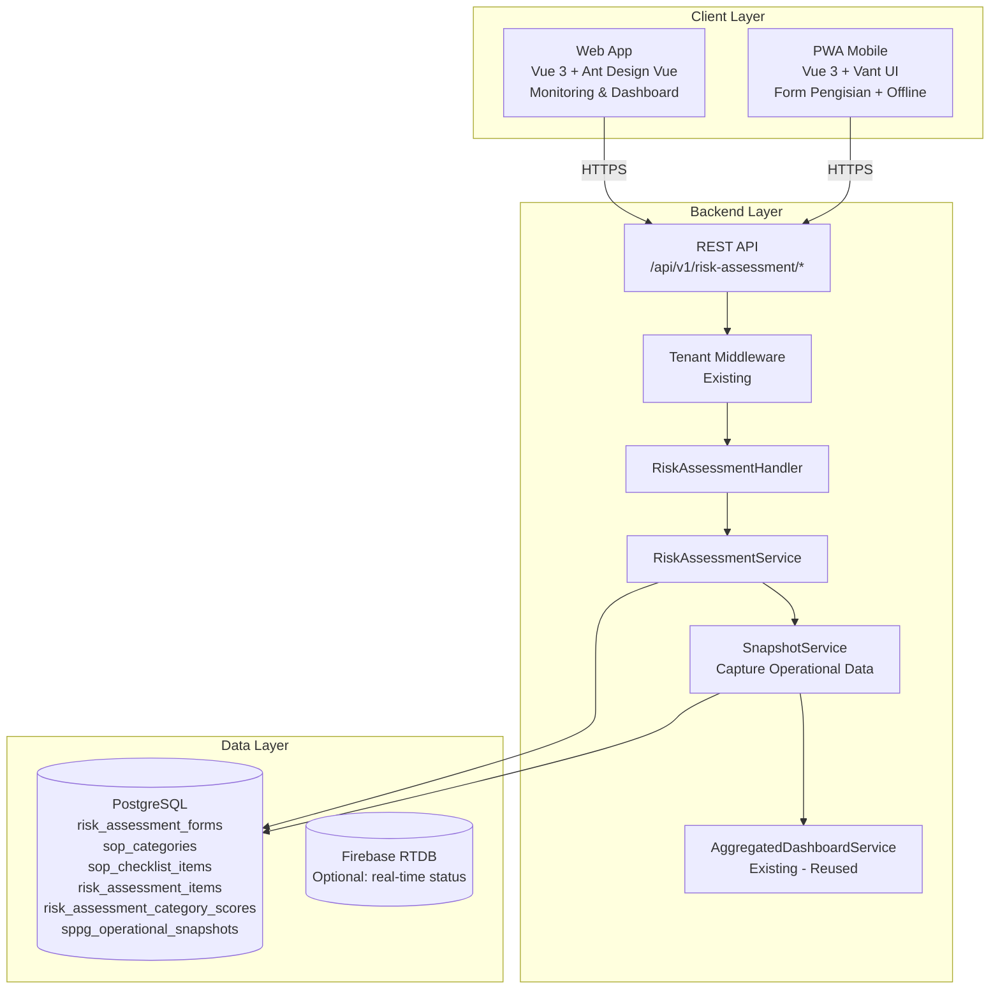
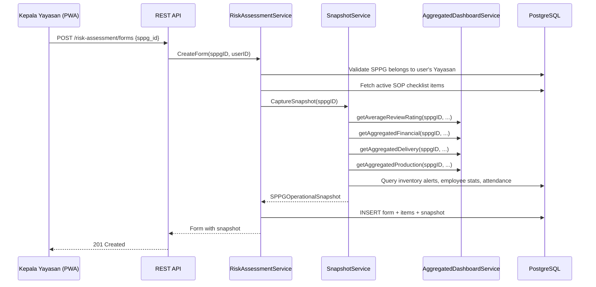
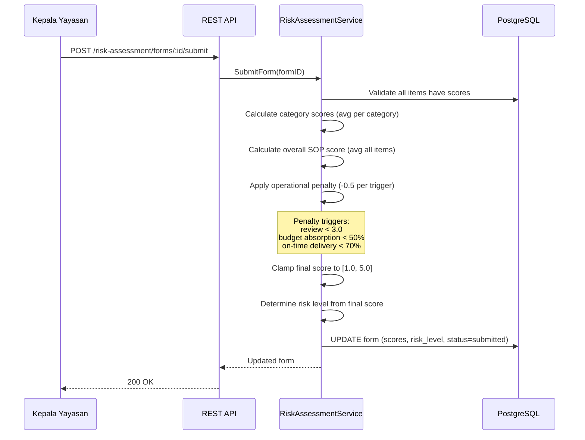

# Dokumen Desain: Risk Assessment (Audit Kepatuhan SOP)

## Overview

Fitur Risk Assessment memungkinkan Kepala Yayasan melakukan audit kepatuhan SOP terhadap SPPG melalui formulir penilaian risiko. Fitur ini mencakup:

1. **Manajemen Template SOP**: CRUD checklist item yang dikelompokkan per kategori SOP, dikelola oleh superadmin
2. **Formulir Risk Assessment di PWA**: Pengisian formulir audit saat kunjungan lapangan dengan dukungan offline
3. **Kalkulasi Skor**: Perhitungan otomatis skor per kategori, overall risk score, dan risk level — termasuk penalti dari data operasional
4. **Snapshot Data Operasional SPPG**: Capture otomatis metrik operasional SPPG (review, keuangan, produksi, pengiriman, stok, HR) saat formulir dibuat
5. **Monitoring di Web App**: Dashboard riwayat audit dengan filter, statistik, dan tren
6. **Tenant Isolation**: Data risk assessment terisolasi sesuai hierarki Yayasan → SPPG
7. **API REST**: Endpoint konsisten untuk web app dan PWA app

### Prinsip Desain

- **Reuse Existing Patterns**: Mengikuti pola yang sudah ada di codebase (handler → service → model, tenant middleware, GORM scopes)
- **Snapshot Immutability**: Data operasional di-capture sekali saat form dibuat dan tidak berubah meskipun data sumber berubah
- **Offline-First PWA**: Form disimpan di IndexedDB saat offline, sync otomatis saat online
- **Backward Compatible**: Tidak mengubah endpoint atau model yang sudah ada
- **Leverage AggregatedDashboardService**: Query metrik operasional SPPG menggunakan helper methods yang sudah ada di `AggregatedDashboardService`

## Architecture

### Arsitektur Komponen Risk Assessment



### Alur Pembuatan Risk Assessment Form



### Alur Submit dan Kalkulasi Skor



## Components and Interfaces

### 1. SOP Template Management (Superadmin)

```
GET    /api/v1/risk-assessment/sop-categories              — Daftar semua kategori SOP
POST   /api/v1/risk-assessment/sop-categories              — Buat kategori SOP baru
PUT    /api/v1/risk-assessment/sop-categories/:id          — Update kategori SOP
GET    /api/v1/risk-assessment/sop-checklist-items          — Daftar semua checklist items
POST   /api/v1/risk-assessment/sop-checklist-items          — Buat checklist item baru
PUT    /api/v1/risk-assessment/sop-checklist-items/:id      — Update checklist item
PATCH  /api/v1/risk-assessment/sop-checklist-items/:id/status — Aktifkan/nonaktifkan item
```

Akses: `superadmin` only (via `middleware.RequireRole("superadmin")`)

### 2. Risk Assessment Form CRUD (Kepala Yayasan)

```
POST   /api/v1/risk-assessment/forms                       — Buat form baru (+ auto-capture snapshot)
GET    /api/v1/risk-assessment/forms                       — Daftar forms (filtered by tenant)
GET    /api/v1/risk-assessment/forms/:id                   — Detail form + items + snapshot
PUT    /api/v1/risk-assessment/forms/:id                   — Update draft form (scores, notes)
POST   /api/v1/risk-assessment/forms/:id/submit            — Submit form (trigger kalkulasi)
POST   /api/v1/risk-assessment/forms/:id/evidence          — Upload foto evidence
GET    /api/v1/risk-assessment/stats                       — Statistik per SPPG
```

Akses: `kepala_yayasan`, `superadmin` (read+write). Tenant middleware memfilter berdasarkan yayasan_id.

### 3. RiskAssessmentService

```go
type RiskAssessmentService struct {
    db              *gorm.DB
    snapshotService *SnapshotService
}

// Form operations
func (s *RiskAssessmentService) CreateForm(sppgID, createdByUserID uint) (*RiskAssessmentForm, error)
func (s *RiskAssessmentService) GetForm(formID uint) (*RiskAssessmentForm, error)
func (s *RiskAssessmentService) ListForms(filter FormFilter) ([]RiskAssessmentForm, int64, error)
func (s *RiskAssessmentService) UpdateDraft(formID uint, items []UpdateItemRequest) error
func (s *RiskAssessmentService) SubmitForm(formID uint) (*RiskAssessmentForm, error)
func (s *RiskAssessmentService) GetStats(sppgIDs []uint) (*RiskAssessmentStats, error)

// Score calculation (internal)
func (s *RiskAssessmentService) calculateCategoryScores(form *RiskAssessmentForm) []RiskAssessmentCategoryScore
func (s *RiskAssessmentService) calculateOverallScore(form *RiskAssessmentForm) float64
func (s *RiskAssessmentService) applyOperationalPenalty(sopScore float64, snapshot *SPPGOperationalSnapshot) float64
func (s *RiskAssessmentService) determineRiskLevel(score float64) string
```

### 4. SnapshotService

Menggunakan helper methods dari `AggregatedDashboardService` yang sudah ada untuk query metrik, ditambah query langsung untuk data yang belum ada di aggregated service (inventory alerts, employee count, attendance rate).

```go
type SnapshotService struct {
    db                *gorm.DB
    aggregatedService *AggregatedDashboardService
}

func (s *SnapshotService) CaptureSnapshot(sppgID uint) (*SPPGOperationalSnapshot, error)
```

### 5. RiskAssessmentHandler

```go
type RiskAssessmentHandler struct {
    service *RiskAssessmentService
}

// SOP Template endpoints
func (h *RiskAssessmentHandler) GetSOPCategories(c *gin.Context)
func (h *RiskAssessmentHandler) CreateSOPCategory(c *gin.Context)
func (h *RiskAssessmentHandler) UpdateSOPCategory(c *gin.Context)
func (h *RiskAssessmentHandler) GetSOPChecklistItems(c *gin.Context)
func (h *RiskAssessmentHandler) CreateSOPChecklistItem(c *gin.Context)
func (h *RiskAssessmentHandler) UpdateSOPChecklistItem(c *gin.Context)
func (h *RiskAssessmentHandler) SetSOPChecklistItemStatus(c *gin.Context)

// Form endpoints
func (h *RiskAssessmentHandler) CreateForm(c *gin.Context)
func (h *RiskAssessmentHandler) GetForms(c *gin.Context)
func (h *RiskAssessmentHandler) GetForm(c *gin.Context)
func (h *RiskAssessmentHandler) UpdateDraft(c *gin.Context)
func (h *RiskAssessmentHandler) SubmitForm(c *gin.Context)
func (h *RiskAssessmentHandler) UploadEvidence(c *gin.Context)
func (h *RiskAssessmentHandler) GetStats(c *gin.Context)
```

### 6. Format Respons API

Mengikuti format yang sudah ada di sistem:

```json
{
  "success": true,
  "data": { ... },
  "message": "Berhasil membuat formulir risk assessment"
}
```

Error response:
```json
{
  "success": false,
  "error_code": "VALIDATION_ERROR",
  "message": "Semua item checklist harus memiliki skor sebelum submit"
}
```

### 7. PWA Offline Support

PWA menggunakan IndexedDB untuk menyimpan draft form saat offline:

- **Saat online**: POST ke API, simpan response ke IndexedDB sebagai cache
- **Saat offline**: Simpan form ke IndexedDB dengan status `pending_sync`
- **Saat reconnect**: Background sync mengirim semua `pending_sync` forms ke API
- **Conflict resolution**: Server timestamp wins — jika form sudah ada di server, skip

Struktur IndexedDB:
```
risk_assessment_drafts: { id, sppg_id, items[], snapshot, status, updated_at }
risk_assessment_cache: { id, form_data, cached_at }
```

## Data Models

### SOP Category

```go
// SOPCategory merepresentasikan kategori utama dalam SOP Dapur MBG
type SOPCategory struct {
    ID          uint      `gorm:"primaryKey" json:"id"`
    Nama        string    `gorm:"size:200;not null;uniqueIndex" json:"nama" validate:"required"`
    Deskripsi   string    `gorm:"type:text" json:"deskripsi"`
    Urutan      int       `gorm:"not null;index" json:"urutan"`
    IsActive    bool      `gorm:"default:true;index" json:"is_active"`
    CreatedAt   time.Time `json:"created_at"`
    UpdatedAt   time.Time `json:"updated_at"`
}
```

### SOP Checklist Item

```go
// SOPChecklistItem merepresentasikan item individual dalam SOP yang dinilai
type SOPChecklistItem struct {
    ID            uint        `gorm:"primaryKey" json:"id"`
    SOPCategoryID uint        `gorm:"index;not null" json:"sop_category_id"`
    Nama          string      `gorm:"size:500;not null" json:"nama" validate:"required"`
    Deskripsi     string      `gorm:"type:text" json:"deskripsi"`
    Urutan        int         `gorm:"not null;index" json:"urutan"`
    IsActive      bool        `gorm:"default:true;index" json:"is_active"`
    CreatedAt     time.Time   `json:"created_at"`
    UpdatedAt     time.Time   `json:"updated_at"`
    SOPCategory   SOPCategory `gorm:"foreignKey:SOPCategoryID" json:"sop_category,omitempty"`
}
```

### Risk Assessment Form

```go
// RiskAssessmentForm merepresentasikan formulir audit risk assessment
type RiskAssessmentForm struct {
    ID                uint                          `gorm:"primaryKey" json:"id"`
    SPPGID            uint                          `gorm:"index;not null" json:"sppg_id"`
    YayasanID         uint                          `gorm:"index;not null" json:"yayasan_id"`
    CreatedByUserID   uint                          `gorm:"index;not null" json:"created_by_user_id"`
    Status            string                        `gorm:"size:20;not null;index;default:'draft'" json:"status"` // draft, submitted
    OverallRiskScore  *float64                      `json:"overall_risk_score"`
    RiskLevel         *string                       `gorm:"size:20" json:"risk_level"` // rendah, sedang, tinggi
    SubmittedAt       *time.Time                    `gorm:"index" json:"submitted_at"`
    CreatedAt         time.Time                     `gorm:"index" json:"created_at"`
    UpdatedAt         time.Time                     `json:"updated_at"`
    SPPG              SPPG                          `gorm:"foreignKey:SPPGID" json:"sppg,omitempty"`
    Yayasan           Yayasan                       `gorm:"foreignKey:YayasanID" json:"yayasan,omitempty"`
    CreatedByUser     User                          `gorm:"foreignKey:CreatedByUserID" json:"created_by_user,omitempty"`
    Items             []RiskAssessmentItem          `gorm:"foreignKey:FormID" json:"items,omitempty"`
    CategoryScores    []RiskAssessmentCategoryScore `gorm:"foreignKey:FormID" json:"category_scores,omitempty"`
    Snapshot          *SPPGOperationalSnapshot      `gorm:"foreignKey:FormID" json:"snapshot,omitempty"`
}
```

### Risk Assessment Item

```go
// RiskAssessmentItem merepresentasikan penilaian per checklist item dalam form
type RiskAssessmentItem struct {
    ID                uint      `gorm:"primaryKey" json:"id"`
    FormID            uint      `gorm:"index;not null" json:"form_id"`
    SOPChecklistItemID uint     `gorm:"index;not null" json:"sop_checklist_item_id"`
    SOPCategoryID     uint      `gorm:"index;not null" json:"sop_category_id"`
    ItemNama          string    `gorm:"size:500;not null" json:"item_nama"`           // Snapshot nama item saat form dibuat
    CategoryNama      string    `gorm:"size:200;not null" json:"category_nama"`       // Snapshot nama kategori
    ComplianceScore   *int      `json:"compliance_score" validate:"omitempty,min=1,max=5"` // 1-5, nil = belum dinilai
    Catatan           string    `gorm:"type:text" json:"catatan"`
    EvidenceURL       string    `gorm:"size:500" json:"evidence_url"`
    CreatedAt         time.Time `json:"created_at"`
    UpdatedAt         time.Time `json:"updated_at"`
}
```

### Risk Assessment Category Score

```go
// RiskAssessmentCategoryScore menyimpan skor rata-rata per kategori SOP
type RiskAssessmentCategoryScore struct {
    ID            uint    `gorm:"primaryKey" json:"id"`
    FormID        uint    `gorm:"index;not null" json:"form_id"`
    SOPCategoryID uint    `gorm:"index;not null" json:"sop_category_id"`
    CategoryNama  string  `gorm:"size:200;not null" json:"category_nama"`
    AverageScore  float64 `gorm:"not null" json:"average_score"`
    RiskLevel     string  `gorm:"size:20;not null" json:"risk_level"` // rendah, sedang, tinggi
    ItemCount     int     `gorm:"not null" json:"item_count"`
}
```

### SPPG Operational Snapshot

```go
// SPPGOperationalSnapshot menyimpan snapshot data operasional SPPG saat audit
type SPPGOperationalSnapshot struct {
    ID        uint `gorm:"primaryKey" json:"id"`
    FormID    uint `gorm:"uniqueIndex;not null" json:"form_id"`

    // Review metrics
    AverageOverallRating  float64 `json:"average_overall_rating"`
    AverageMenuRating     float64 `json:"average_menu_rating"`
    AverageServiceRating  float64 `json:"average_service_rating"`
    TotalReviews          int     `json:"total_reviews"`

    // Financial metrics
    TotalIncome           float64 `json:"total_income"`
    TotalExpense          float64 `json:"total_expense"`
    BudgetTarget          float64 `json:"budget_target"`
    BudgetAbsorptionRate  float64 `json:"budget_absorption_rate"` // percentage

    // Delivery metrics
    TotalDeliveries       int     `json:"total_deliveries"`
    CompletedDeliveries   int     `json:"completed_deliveries"`
    DeliveryCompletionRate float64 `json:"delivery_completion_rate"` // percentage
    OnTimeDeliveryRate    float64 `json:"on_time_delivery_rate"`    // percentage

    // Production metrics
    TotalPortionsProduced int     `json:"total_portions_produced"`
    ProductionCompletionRate float64 `json:"production_completion_rate"` // percentage

    // Inventory metrics
    TotalInventoryItems   int `json:"total_inventory_items"`
    CriticalStockItems    int `json:"critical_stock_items"` // items below min_threshold

    // HR metrics
    TotalActiveEmployees  int     `json:"total_active_employees"`
    AttendanceRate        float64 `json:"attendance_rate"` // percentage bulan berjalan

    // Metadata
    SnapshotPeriodStart time.Time `json:"snapshot_period_start"` // awal bulan berjalan
    SnapshotPeriodEnd   time.Time `json:"snapshot_period_end"`   // tanggal capture
    CapturedAt          time.Time `json:"captured_at"`
}
```

### Score Calculation Logic

```
1. SOP Compliance Score = AVG(semua ComplianceScore dari RiskAssessmentItem)

2. Operational Penalty (maks -1.5):
   - IF AverageOverallRating < 3.0 → penalty += 0.5
   - IF BudgetAbsorptionRate < 50% → penalty += 0.5
   - IF OnTimeDeliveryRate < 70%   → penalty += 0.5

3. Overall Risk Score = CLAMP(SOP_Score - Penalty, 1.0, 5.0)

4. Risk Level:
   - 4.0 - 5.0 → "rendah" (Risiko Rendah)
   - 2.5 - 3.9 → "sedang" (Risiko Sedang)
   - 1.0 - 2.4 → "tinggi" (Risiko Tinggi)
```

### Threshold Indikator Visual Metrik Operasional

| Metrik | Hijau (Baik) | Kuning (Perlu Perhatian) | Merah (Kritis) |
|--------|-------------|-------------------------|----------------|
| Rating Review | ≥ 4.0 | 3.0 - 3.9 | < 3.0 |
| Penyerapan Anggaran | ≥ 80% | 50% - 79% | < 50% |
| On-Time Delivery | ≥ 90% | 70% - 89% | < 70% |
| Completion Rate | ≥ 90% | 70% - 89% | < 70% |
| Stok Kritis | 0 items | 1-3 items | > 3 items |
| Kehadiran | ≥ 90% | 75% - 89% | < 75% |

### Migrasi Database

Tabel baru yang perlu dibuat (GORM AutoMigrate):
- `sop_categories`
- `sop_checklist_items`
- `risk_assessment_forms`
- `risk_assessment_items`
- `risk_assessment_category_scores`
- `sppg_operational_snapshots`

Seed data: 7 kategori SOP default berdasarkan dokumen SOP Dapur MBG.

### Registrasi Route

```go
// Di router.go, dalam blok protected
riskAssessment := protected.Group("/risk-assessment")
{
    // SOP Template (superadmin only)
    sopAdmin := riskAssessment.Group("")
    sopAdmin.Use(middleware.RequireRole("superadmin"))
    {
        sopAdmin.POST("/sop-categories", raHandler.CreateSOPCategory)
        sopAdmin.PUT("/sop-categories/:id", raHandler.UpdateSOPCategory)
        sopAdmin.POST("/sop-checklist-items", raHandler.CreateSOPChecklistItem)
        sopAdmin.PUT("/sop-checklist-items/:id", raHandler.UpdateSOPChecklistItem)
        sopAdmin.PATCH("/sop-checklist-items/:id/status", raHandler.SetSOPChecklistItemStatus)
    }

    // SOP Template read (kepala_yayasan + superadmin)
    riskAssessment.GET("/sop-categories", raHandler.GetSOPCategories)
    riskAssessment.GET("/sop-checklist-items", raHandler.GetSOPChecklistItems)

    // Forms (kepala_yayasan + superadmin)
    forms := riskAssessment.Group("/forms")
    forms.Use(middleware.RequireRole("kepala_yayasan", "superadmin"))
    {
        forms.POST("", raHandler.CreateForm)
        forms.GET("", raHandler.GetForms)
        forms.GET("/:id", raHandler.GetForm)
        forms.PUT("/:id", raHandler.UpdateDraft)
        forms.POST("/:id/submit", raHandler.SubmitForm)
        forms.POST("/:id/evidence", raHandler.UploadEvidence)
    }

    // Stats
    riskAssessment.GET("/stats",
        middleware.RequireRole("kepala_yayasan", "superadmin"),
        raHandler.GetStats)
}
```


## Correctness Properties

*A property is a characteristic or behavior that should hold true across all valid executions of a system — essentially, a formal statement about what the system should do. Properties serve as the bridge between human-readable specifications and machine-verifiable correctness guarantees.*

### Property 1: Risk Assessment Data Round-Trip

*For any* risk assessment item with a valid compliance score (1-5), catatan, and evidence URL, saving the item and then retrieving it should return the exact same score, catatan, and evidence URL.

**Validates: Requirements 1.1, 2.3, 2.4, 2.5**

### Property 2: Form Creation Contains All Active Checklist Items

*For any* set of active SOP checklist items and any new risk assessment form created, the form should contain exactly the set of active items, grouped by their SOP category, with no inactive items included.

**Validates: Requirements 1.5, 2.2**

### Property 3: Checklist Item Snapshot Immutability

*For any* existing risk assessment form, if the source SOP checklist item's nama or deskripsi is updated after the form was created, the form's item_nama should remain unchanged (equal to the value at creation time).

**Validates: Requirements 1.4**

### Property 4: Tenant Isolation for Kepala Yayasan

*For any* Kepala Yayasan querying risk assessment forms, all returned forms should have sppg_id belonging to an SPPG under that Kepala Yayasan's Yayasan. No forms from SPPGs outside their Yayasan should appear in the results.

**Validates: Requirements 2.1, 4.1, 5.2**

### Property 5: Cross-Tenant Access Returns 404

*For any* user attempting to access a risk assessment form belonging to an SPPG outside their tenant scope, the system should return a 404 Not Found response (not 403 Forbidden).

**Validates: Requirements 5.4**

### Property 6: SPPG Ownership Validation on Form Creation

*For any* form creation request, if the specified SPPG does not belong to the requesting Kepala Yayasan's Yayasan, the system should reject the request with a validation error.

**Validates: Requirements 6.2**

### Property 7: Compliance Score Validation

*For any* compliance score value, the system should accept only integer values in the range [1, 5]. Any value outside this range (including 0, negative numbers, and values > 5) should be rejected.

**Validates: Requirements 2.3**

### Property 8: Submit Requires Complete Scores

*For any* risk assessment form submission attempt, if any item has a nil/missing compliance score, the submission should be rejected and the form should remain in draft status.

**Validates: Requirements 3.1, 3.2**

### Property 9: Category Score Calculation Accuracy

*For any* submitted risk assessment form, the average score for each SOP category should equal the arithmetic mean of all compliance scores of items belonging to that category, rounded to the same precision.

**Validates: Requirements 7.1, 7.2**

### Property 10: Overall SOP Score Calculation

*For any* submitted risk assessment form, the base SOP compliance score (before operational penalty) should equal the arithmetic mean of all compliance scores across all items in the form.

**Validates: Requirements 3.3**

### Property 11: Risk Level Mapping Determinism

*For any* score value, the risk level should be deterministically assigned: "rendah" for [4.0, 5.0], "sedang" for [2.5, 3.9], "tinggi" for [1.0, 2.4]. This applies to both overall risk score and per-category scores.

**Validates: Requirements 3.4, 7.4**

### Property 12: Operational Penalty Calculation

*For any* SPPG operational snapshot, the penalty should be exactly 0.5 for each triggered condition (review rating < 3.0, budget absorption < 50%, on-time delivery rate < 70%), with a maximum total penalty of 1.5. The final overall risk score should equal CLAMP(SOP_score - penalty, 1.0, 5.0).

**Validates: Requirements 8.5**

### Property 13: Form Status Lifecycle

*For any* risk assessment form, it should start as "draft" and transition to "submitted" only upon successful submission. Once "submitted", the form's status, scores, and items should be immutable — any update attempt should be rejected.

**Validates: Requirements 2.6, 3.5, 3.6**

### Property 14: Operational Snapshot Immutability

*For any* risk assessment form with an operational snapshot, if the underlying SPPG operational data (reviews, financials, deliveries, etc.) changes after the snapshot was captured, the snapshot values stored with the form should remain unchanged.

**Validates: Requirements 8.3**

### Property 15: Operational Snapshot Completeness

*For any* newly created risk assessment form, the associated SPPG operational snapshot should contain non-default values for all specified metric categories (review, financial, delivery, production, inventory, HR) when the SPPG has operational data. The snapshot should have a valid captured_at timestamp and period range.

**Validates: Requirements 8.1, 8.2**

### Property 16: API Response Format Consistency

*For any* API response from risk assessment endpoints, the response should contain the standard fields: `success` (boolean), and either `data` + `message` (on success) or `error_code` + `message` (on error).

**Validates: Requirements 6.3, 6.4**

### Property 17: Form List Ordering

*For any* list of risk assessment forms returned by the API, the forms should be ordered by created_at descending (newest first).

**Validates: Requirements 4.1**

### Property 18: Auto-Assigned Display Order

*For any* new SOP checklist item added to a category, the system should automatically assign an urutan (display order) value that is greater than all existing items in the same category.

**Validates: Requirements 1.3**

## Error Handling

### Backend Error Scenarios

| Skenario | HTTP Code | Error Code | Pesan |
|----------|-----------|------------|-------|
| SPPG tidak ditemukan atau bukan milik Yayasan | 404 | `SPPG_NOT_FOUND` | "SPPG tidak ditemukan atau tidak berada di bawah Yayasan Anda" |
| Form tidak ditemukan (termasuk cross-tenant) | 404 | `FORM_NOT_FOUND` | "Formulir risk assessment tidak ditemukan" |
| Submit form dengan skor belum lengkap | 400 | `INCOMPLETE_SCORES` | "Item berikut belum memiliki skor: [daftar item]" |
| Update form yang sudah submitted | 400 | `FORM_ALREADY_SUBMITTED` | "Formulir yang sudah disubmit tidak dapat diubah" |
| Compliance score di luar range | 400 | `INVALID_SCORE` | "Compliance score harus antara 1 dan 5" |
| SOP checklist item tidak aktif | 400 | `ITEM_INACTIVE` | "Item checklist sudah tidak aktif" |
| Gagal capture snapshot (service error) | 500 | `SNAPSHOT_ERROR` | "Gagal mengambil data operasional SPPG" |
| File upload gagal | 400 | `UPLOAD_FAILED` | "Gagal mengunggah file evidence" |
| Unauthorized access | 401 | `UNAUTHORIZED` | "Anda tidak memiliki akses" |
| Role tidak diizinkan | 403 | `FORBIDDEN` | "Peran Anda tidak diizinkan mengakses fitur ini" |

### PWA Offline Error Handling

- **Network timeout**: Simpan ke IndexedDB, tampilkan notifikasi "Tersimpan offline, akan disinkronkan saat online"
- **Sync conflict**: Jika form sudah ada di server (duplicate), skip dan mark as synced
- **Storage full**: Tampilkan peringatan dan sarankan hapus cache lama

## Testing Strategy

### Unit Tests

Unit tests fokus pada contoh spesifik dan edge cases:

- Seed data: verifikasi 7 kategori SOP default ter-create
- API endpoint existence: verifikasi semua endpoint merespons dengan benar
- Score boundary: skor 1, 5 diterima; skor 0, 6 ditolak
- Risk level boundary: skor 2.4 → tinggi, 2.5 → sedang, 3.9 → sedang, 4.0 → rendah
- Empty form submission: form tanpa item → error
- Penalty edge cases: semua 3 trigger aktif → penalty 1.5; tidak ada trigger → penalty 0
- Snapshot dengan SPPG tanpa data operasional → semua metrik 0
- Cross-tenant access → 404
- Submit form yang sudah submitted → error
- Upload evidence ke form yang sudah submitted → error

### Property-Based Tests

Menggunakan library `gopter` (Go property testing library) atau `rapid` untuk Go.

Konfigurasi: minimum 100 iterasi per property test.

Setiap test di-tag dengan komentar referensi ke design property:

```go
// Feature: risk-assessment, Property 1: Risk Assessment Data Round-Trip
// Feature: risk-assessment, Property 7: Compliance Score Validation
// Feature: risk-assessment, Property 9: Category Score Calculation Accuracy
// Feature: risk-assessment, Property 10: Overall SOP Score Calculation
// Feature: risk-assessment, Property 11: Risk Level Mapping Determinism
// Feature: risk-assessment, Property 12: Operational Penalty Calculation
// Feature: risk-assessment, Property 13: Form Status Lifecycle
```

Library yang digunakan: **`pgregory.net/rapid`** — library property-based testing untuk Go yang modern dan well-maintained.

Setiap correctness property di atas HARUS diimplementasikan oleh SATU property-based test. Property tests fokus pada:
- Generasi random compliance scores (1-5) untuk verifikasi kalkulasi
- Generasi random snapshot values untuk verifikasi penalty logic
- Generasi random form states untuk verifikasi lifecycle transitions
- Generasi random tenant contexts untuk verifikasi isolation
