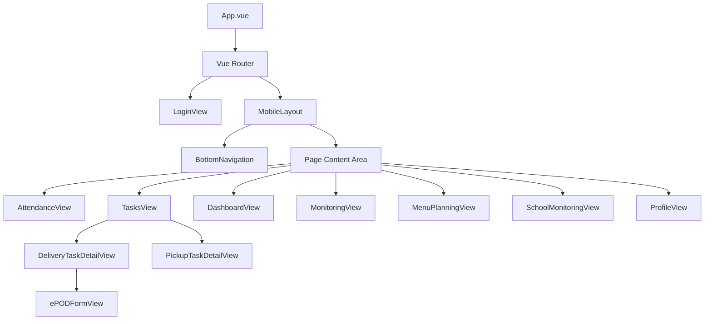

# UI Redesign Horizon - Design Document

## Overview

Redesign total UI aplikasi PWA ERP SPPG mengikuti style referensi HR Attendee app. Aplikasi ini adalah Progressive Web App (PWA) mobile-first yang dibangun dengan Vue 3, Vant UI, dan Pinia. Redesign mencakup:

- Penerapan design system konsisten dengan color palette purple (#5A4372)
- Redesign seluruh halaman existing (Login, Absensi, Tugas, Detail Tugas, e-POD, Profil)
- Penambahan 3 modul baru view-only: Dashboard, Monitoring Aktivitas, Perencanaan Menu
- Komponen mobile-native: Bottom Navigation, Card-based layout, Swipe Actions, Pull-to-Refresh, Skeleton Loading
- Tidak ada dark mode — fokus pada light theme dengan purple palette

**Tech Stack**: Vue 3 + Vant UI 4 + Pinia + Vue Router 4 + Vite

## Architecture

### Arsitektur Komponen



### Strategi Migrasi

- **Hybrid Approach**: Buat komponen wrapper baru di atas Vant UI dengan styling custom
- **Gradual Migration**: Redesign per halaman, tidak breaking changes
- **Preserve Business Logic**: Seluruh logic existing (auth, attendance, tasks, offline sync) tetap dipertahankan
- **CSS Override**: Gunakan `horizon-mobile.css` untuk override Vant UI default styles

### Folder Structure

```
pwa/src/
├── components/
│   ├── mobile/
│   │   ├── BottomNavigation.vue      # Bottom nav bar role-based
│   │   ├── SummaryCard.vue           # Stat card dengan icon & value
│   │   ├── SwipeAction.vue           # Swipe gesture check-in/out
│   │   ├── DateSelector.vue          # Date picker header
│   │   ├── ActivityLogItem.vue       # Log item dengan timestamp
│   │   ├── TaskCard.vue              # Card tugas dengan status tag
│   │   ├── MenuWeekCard.vue          # Card rencana menu mingguan
│   │   ├── SkeletonCard.vue          # Skeleton loading placeholder
│   │   └── MiniCalendar.vue          # Kalender mini kehadiran
│   ├── SyncStatusIndicator.vue       # Existing
│   └── SyncStatusModal.vue           # Existing
├── layouts/
│   └── MobileLayout.vue              # Main layout with BottomNav
├── views/                            # Existing + new views
│   ├── LoginView.vue                 # Redesign
│   ├── AttendanceView.vue            # Redesign
│   ├── TasksView.vue                 # Redesign
│   ├── DeliveryTaskDetailView.vue    # Redesign
│   ├── PickupTaskDetailView.vue      # Redesign
│   ├── ePODFormView.vue              # Redesign
│   ├── ProfileView.vue              # Redesign
│   ├── DashboardView.vue             # NEW
│   ├── MonitoringView.vue            # NEW
│   ├── SchoolMonitoringView.vue      # NEW - Sekolah role
│   └── MenuPlanningView.vue          # NEW
├── styles/
│   └── horizon-mobile.css            # Design system CSS (existing, update)
├── stores/
│   ├── auth.js                       # Existing
│   ├── deliveryTasks.js              # Existing
│   ├── dashboard.js                  # NEW
│   ├── monitoring.js                 # NEW
│   ├── schoolMonitoring.js           # NEW - Sekolah role
│   └── menuPlanning.js               # NEW
└── router/
    └── index.js                      # Update routes + guards
```

## Components and Interfaces

### Design System - CSS Variables

```css
:root {
  /* Primary Colors - Purple Palette */
  --h-primary: #5A4372;
  --h-primary-hover: #4a3562;
  --h-primary-active: #3a2752;
  --h-primary-light: #6a5382;
  --h-primary-lighter: rgba(90, 67, 114, 0.1);

  /* Accent */
  --h-accent: #3D2B53;
  --h-accent-light: #4d3b63;

  /* Backgrounds */
  --h-bg-primary: #F8FDEA;
  --h-bg-secondary: #FFFFFF;
  --h-bg-card: #FFFFFF;

  /* Text Colors */
  --h-text-primary: #322837;
  --h-text-secondary: #74788C;
  --h-text-light: #ACA9B0;

  /* Semantic Colors */
  --h-success: #05CD99;
  --h-warning: #FFB547;
  --h-error: #EE5D50;

  /* Shadows */
  --h-shadow-card: 0px 18px 40px rgba(112, 144, 176, 0.12);

  /* Border Radius */
  --h-radius-sm: 8px;
  --h-radius-md: 12px;
  --h-radius-lg: 16px;

  /* Typography */
  --h-font-family: 'DM Sans', -apple-system, BlinkMacSystemFont, 'Segoe UI', sans-serif;

  /* Transitions */
  --h-transition-base: 200ms ease-in-out;
}
```


### Core Mobile Components

#### 1. BottomNavigation.vue

Navigasi utama di bawah layar, role-based items mengikuti style HR Attendee app.

```typescript
// Props
interface BottomNavigationProps {
  // No props needed - reads role from auth store
}

// Emits
// 'navigate' -> (routeName: string)

// Internal Logic
// - Reads user role from Pinia auth store
// - Renders van-tabbar with role-appropriate items
// - Active item: color #5A4372, filled icon
// - Inactive item: color #ACA9B0, outline icon
// - Height: 56px, background white, top shadow
```

Role-based navigation items:

| Role | Items |
|------|-------|
| Driver / Asisten Lapangan | Tugas, Absensi, Profil |
| Kepala SPPG | Dashboard, Monitoring, Menu, Absensi, Profil |
| Ahli Gizi | Menu, Absensi, Profil |
| Sekolah | Monitoring, Profil |
| Default (Karyawan) | Absensi, Profil |

#### 2. SummaryCard.vue

Kartu ringkasan statistik dengan ikon, label, dan nilai.

```typescript
interface SummaryCardProps {
  icon: string           // Vant icon name
  iconColor: string      // Icon background color (default: --h-primary)
  label: string          // "Total Hadir", "Tugas Selesai"
  value: string | number // "24", "95%"
  loading: boolean       // Show skeleton
}
```

Styling: `border-radius: 16px`, `box-shadow: var(--h-shadow-card)`, padding 16px, icon in 40x40 circle with `--h-primary-lighter` background.

#### 3. SwipeAction.vue

Gesture swipe horizontal untuk check-in (kanan) dan check-out (kiri).

```typescript
interface SwipeActionProps {
  canCheckIn: boolean
  canCheckOut: boolean
  loading: boolean
}

// Emits
// 'check-in' -> ()
// 'check-out' -> ()
```

Visual: Rounded pill shape, gradient track `#5A4372 → #3D2B53`, white slider thumb, directional arrow icons.

#### 4. DateSelector.vue

Pemilih tanggal di header halaman menggunakan `van-calendar`.

```typescript
interface DateSelectorProps {
  modelValue: Date
  minDate?: Date
  maxDate?: Date
}

// Emits
// 'update:modelValue' -> (date: Date)
```

#### 5. TaskCard.vue

Kartu tugas dengan informasi sekolah, jenis, status, dan urutan rute.

```typescript
interface TaskCardProps {
  schoolName: string
  address: string
  taskType: 'delivery' | 'pickup'  // delivery=hijau, pickup=oranye
  status: 'pending' | 'in_progress' | 'completed'
  routeOrder: number
}

// Emits
// 'click' -> ()
```

Tag colors: delivery → `--h-success` background, pickup → `--h-warning` background.

#### 6. ActivityLogItem.vue

Item log aktivitas dengan timestamp dan status badge.

```typescript
interface ActivityLogItemProps {
  employeeName: string
  activityType: 'attendance' | 'delivery' | 'pickup'
  timestamp: string
  status: string
}
```

#### 7. MenuWeekCard.vue

Kartu rencana menu mingguan dengan status approval.

```typescript
interface MenuWeekCardProps {
  weekPeriod: string        // "Minggu 1 - 7 Jan 2025"
  approvalStatus: 'pending' | 'approved' | 'rejected'
  menuCount: number
  canApprove: boolean       // true for Kepala_SPPG on pending items
}

// Emits
// 'approve' -> ()
// 'reject' -> ()
// 'click' -> ()
```

#### 8. SkeletonCard.vue

Placeholder loading menggunakan `van-skeleton`.

```typescript
interface SkeletonCardProps {
  rows?: number    // Default 3
  avatar?: boolean // Show avatar placeholder
  title?: boolean  // Show title placeholder
}
```

#### 9. MiniCalendar.vue

Kalender mini bulan berjalan yang menandai status kehadiran.

```typescript
interface MiniCalendarProps {
  attendanceData: Array<{
    date: string
    status: 'present' | 'absent' | 'late'
  }>
  selectedDate?: string
}

// Emits
// 'select-date' -> (date: string)
```

Dot colors: present → `--h-success`, absent → `--h-error`, late → `--h-warning`.

### Layout Component

#### MobileLayout.vue

Layout utama yang membungkus semua halaman setelah login.

```vue
<template>
  <div class="mobile-layout">
    <div class="mobile-content">
      <router-view v-slot="{ Component }">
        <transition name="page-slide" mode="out-in">
          <component :is="Component" />
        </transition>
      </router-view>
    </div>
    <BottomNavigation />
  </div>
</template>
```

Styling:
- `min-height: 100vh`, `background: var(--h-bg-primary)`
- Content area: `padding-bottom: 72px` (clearance for bottom nav)
- Page transition: slide left/right 200ms

### Page Layouts

#### Login Page

```
┌──────────────────────────┐
│                          │
│  Gradient Background     │
│  #5A4372 → #3D2B53      │
│                          │
│      [Logo]              │
│    ERP SPPG              │
│    Subtitle              │
│                          │
│  ┌──────────────────┐    │
│  │  Card (white)    │    │
│  │                  │    │
│  │  NIK / Email     │    │
│  │  [____________]  │    │
│  │                  │    │
│  │  Password        │    │
│  │  [____________]  │    │
│  │                  │    │
│  │  [  LOGIN  ]     │    │
│  │  (purple btn)    │    │
│  └──────────────────┘    │
│                          │
└──────────────────────────┘
```

- Background: `linear-gradient(180deg, #5A4372 0%, #3D2B53 100%)`
- Card: white, `border-radius: 16px`, shadow, centered
- Login button: full-width, height 48px, `border-radius: 12px`, `background: #5A4372`

#### Attendance Page

```
┌──────────────────────────┐
│ NavBar: Absensi          │
│ (bg: #5A4372, white txt) │
├──────────────────────────┤
│ Nama Karyawan            │
│ [Date Selector]          │
├──────────────────────────┤
│ ┌──────┐  ┌──────┐      │
│ │Check │  │Check │      │
│ │ In   │  │ Out  │      │
│ │08:00 │  │17:00 │      │
│ │(hijau)│  │(merah)│     │
│ └──────┘  └──────┘      │
├──────────────────────────┤
│ [Swipe Action Bar]       │
│ ← Check Out | Check In → │
├──────────────────────────┤
│ Summary Cards (scroll-x) │
│ [Hari Kerja][Jam][Hadir] │
├──────────────────────────┤
│ Mini Calendar            │
│ ● hadir ● absent ● late │
├──────────────────────────┤
│ Riwayat 7 Hari           │
│ ┌────────────────────┐   │
│ │ Sen, 6 Jan         │   │
│ │ 08:00 - 17:00 (9j) │   │
│ └────────────────────┘   │
│ ┌────────────────────┐   │
│ │ Sel, 7 Jan         │   │
│ │ 08:15 - 17:00 (8j) │   │
│ └────────────────────┘   │
├──────────────────────────┤
│ [Bottom Navigation]      │
└──────────────────────────┘
```

#### Tasks Page

```
┌──────────────────────────┐
│ NavBar: Tugas (5)        │
│ (bg: #5A4372)    [↻]    │
├──────────────────────────┤
│ Tab Selection            │
│ [Pengiriman] Pengambilan │
│  (active)    (inactive)  │
│  pill bg     gray text   │
├──────────────────────────┤
│ Summary Cards            │
│ [Menunggu][Jalan][Selesai]│
│ (counts filtered by tab) │
├──────────────────────────┤
│ Daftar Tugas (filtered)  │
│ ┌────────────────────┐   │
│ │ #1 SD Negeri 1     │   │
│ │ Jl. Merdeka 10     │   │
│ │ [Pengiriman] Pending│   │
│ └────────────────────┘   │
│ ┌────────────────────┐   │
│ │ #2 SMP Negeri 3    │   │
│ │ Jl. Sudirman 5     │   │
│ │ [Pengiriman] Done  │   │
│ └────────────────────┘   │
├──────────────────────────┤
│ [Bottom Navigation]      │
└──────────────────────────┘
```

Tab Selection Styling:
- Active tab: `background: #5A4372`, `color: #FFFFFF`, `border-radius: 20px` (pill shape), `padding: 8px 20px`
- Inactive tab: `background: transparent`, `color: #74788C`
- Tab container: `display: flex`, `gap: 8px`, `padding: 12px 16px`, horizontal alignment
- Uses `van-tabs` with custom CSS override for pill style (no underline indicator)

Tab Filtering Behavior:
- "Pengiriman" tab shows only tasks with `taskType === 'delivery'`
- "Pengambilan" tab shows only tasks with `taskType === 'pickup'`
- Summary Cards (Menunggu, Dalam Perjalanan, Selesai) update counts based on active tab's filtered tasks
- Default active tab: "Pengiriman"
- Tab state is local to the component (not persisted in store or URL)

#### Task Detail Page

```
┌──────────────────────────┐
│ ← Detail Tugas           │
│ (NavBar #5A4372)         │
├──────────────────────────┤
│ Progress Steps           │
│ ●───●───○───○            │
│ Assign Jalan Sampai Done │
├──────────────────────────┤
│ ┌────────────────────┐   │
│ │ Status Card        │   │
│ │ Dalam Perjalanan   │   │
│ └────────────────────┘   │
│ ┌────────────────────┐   │
│ │ Info Sekolah       │   │
│ │ SD Negeri 1        │   │
│ │ Jl. Merdeka 10     │   │
│ │ [📍 Google Maps]   │   │
│ └────────────────────┘   │
│ ┌────────────────────┐   │
│ │ Info Menu/Porsi    │   │
│ │ Nasi Goreng x50    │   │
│ └────────────────────┘   │
│ ┌────────────────────┐   │
│ │ Aksi               │   │
│ │ [Mulai Perjalanan] │   │
│ └────────────────────┘   │
├──────────────────────────┤
│ [Bottom Navigation]      │
└──────────────────────────┘
```

#### Dashboard Page (Kepala SPPG)

```
┌──────────────────────────┐
│ NavBar: Dashboard        │
│ (bg: #5A4372)            │
├──────────────────────────┤
│ Summary Cards (2x2 grid) │
│ ┌──────┐  ┌──────┐      │
│ │Hadir │  │Kirim │      │
│ │ 45   │  │ 12   │      │
│ └──────┘  └──────┘      │
│ ┌──────┐  ┌──────┐      │
│ │Selesai│  │Sekolah│     │
│ │ 8    │  │ 15   │      │
│ └──────┘  └──────┘      │
├──────────────────────────┤
│ ┌────────────────────┐   │
│ │ Grafik Kehadiran   │   │
│ │ 7 Hari Terakhir    │   │
│ │ [Bar Chart]        │   │
│ └────────────────────┘   │
├──────────────────────────┤
│ ┌────────────────────┐   │
│ │ Tugas Terbaru      │   │
│ │ - SD 1: Selesai    │   │
│ │ - SMP 3: Jalan     │   │
│ └────────────────────┘   │
├──────────────────────────┤
│ [Bottom Navigation]      │
└──────────────────────────┘
```

#### Monitoring Page (Kepala SPPG)

```
┌──────────────────────────┐
│ NavBar: Monitoring       │
│ (bg: #5A4372)            │
├──────────────────────────┤
│ [Date Selector]          │
├──────────────────────────┤
│ Filter Chips             │
│ [Semua][Absensi][Kirim]  │
├──────────────────────────┤
│ Activity List            │
│ ┌────────────────────┐   │
│ │ Budi - Check In    │   │
│ │ 08:00 ● Hadir      │   │
│ └────────────────────┘   │
│ ┌────────────────────┐   │
│ │ Andi - Pengiriman  │   │
│ │ 09:30 ● Selesai    │   │
│ └────────────────────┘   │
│ ... (infinite scroll)    │
├──────────────────────────┤
│ [Bottom Navigation]      │
└──────────────────────────┘
```

#### Menu Planning Page

```
┌──────────────────────────┐
│ NavBar: Perencanaan Menu │
│ (bg: #5A4372)            │
├──────────────────────────┤
│ [Date Selector - Minggu] │
├──────────────────────────┤
│ Menu Mingguan            │
│ ┌────────────────────┐   │
│ │ Minggu 1-7 Jan     │   │
│ │ 5 menu │ ● Pending │   │
│ │ [Approve] [Reject] │   │
│ │ (Kepala SPPG only) │   │
│ └────────────────────┘   │
│ ┌────────────────────┐   │
│ │ Minggu 8-14 Jan    │   │
│ │ 5 menu │ ✓ Approved│   │
│ └────────────────────┘   │
├──────────────────────────┤
│ Detail Menu Harian       │
│ ┌────────────────────┐   │
│ │ Senin              │   │
│ │ Nasi Goreng        │   │
│ │ Ayam, Sayur, Buah  │   │
│ │ 150 porsi          │   │
│ └────────────────────┘   │
├──────────────────────────┤
│ [Bottom Navigation]      │
└──────────────────────────┘
```

#### School Monitoring Page (Sekolah)

```
┌──────────────────────────┐
│ NavBar: Monitoring       │
│ (bg: #5A4372)            │
├──────────────────────────┤
│ Nama Sekolah             │
│ Hari ini, 7 Jan 2025     │
├──────────────────────────┤
│ ┌────────────────────┐   │
│ │ Menu Hari Ini      │   │
│ │ Nasi Goreng        │   │
│ │ Ayam, Sayur, Buah  │   │
│ │ 150 porsi          │   │
│ └────────────────────┘   │
├──────────────────────────┤
│ ┌────────────────────┐   │
│ │ Status Pengiriman  │   │
│ │ ● Dalam Perjalanan │   │
│ │ Driver: Budi       │   │
│ │ Est: 10:30         │   │
│ └────────────────────┘   │
├──────────────────────────┤
│ ┌────────────────────┐   │
│ │ Status Pengambilan │   │
│ │ ● Terjadwal        │   │
│ │ Driver: Andi       │   │
│ │ Est: 14:00         │   │
│ └────────────────────┘   │
│ (shown if applicable)    │
├──────────────────────────┤
│ [Bottom Navigation]      │
└──────────────────────────┘
```

#### Profile Page

```
┌──────────────────────────┐
│                          │
│  Gradient Banner         │
│  #5A4372 → #3D2B53      │
│                          │
│      [Avatar]            │
│    Nama Lengkap          │
│    NIK: 12345            │
├──────────────────────────┤
│ Tabs: [Personal][Setting]│
├──────────────────────────┤
│ ┌────────────────────┐   │
│ │ NIK: 12345         │   │
│ │ Nama: John Doe     │   │
│ │ Email: john@...    │   │
│ │ Role: Driver       │   │
│ └────────────────────┘   │
├──────────────────────────┤
│ [  LOGOUT  ]             │
│ (full-width, red)        │
├──────────────────────────┤
│ [Bottom Navigation]      │
└──────────────────────────┘
```


## Data Models

### Pinia Stores

#### Auth Store (existing - updated for Sekolah role)

```typescript
interface AuthState {
  user: {
    id: string
    nik: string
    name: string
    email: string
    role: 'driver' | 'asisten_lapangan' | 'kepala_sppg' | 'ahli_gizi' | 'sekolah' | 'karyawan'
    avatar?: string
    schoolId?: string  // Only set for role 'sekolah', references the assigned school
  } | null
  token: string | null
  isAuthenticated: boolean
}
```

#### Dashboard Store (NEW)

```typescript
interface DashboardState {
  summary: {
    totalHadir: number
    totalPengiriman: number
    totalSelesai: number
    totalSekolah: number
  }
  attendanceChart: Array<{ date: string; count: number }>  // 7 hari
  recentTasks: Array<{
    id: string
    schoolName: string
    status: 'pending' | 'in_progress' | 'completed'
    taskType: 'delivery' | 'pickup'
  }>
  loading: boolean
  error: string | null
}
```

#### Monitoring Store (NEW)

```typescript
interface MonitoringState {
  activities: Array<{
    id: string
    employeeName: string
    activityType: 'attendance' | 'delivery' | 'pickup'
    timestamp: string
    status: string
  }>
  selectedDate: string
  filterType: 'all' | 'attendance' | 'delivery' | 'pickup'
  loading: boolean
  hasMore: boolean  // for infinite scroll
  page: number
  error: string | null
}
```

#### Menu Planning Store (NEW)

```typescript
interface MenuPlanningState {
  weeklyPlans: Array<{
    id: string
    weekPeriod: string
    approvalStatus: 'pending' | 'approved' | 'rejected'
    menuCount: number
    menus: Array<{
      day: string
      menuName: string
      components: string[]
      portions: number
    }>
  }>
  selectedWeek: string | null
  loading: boolean
  approvalLoading: boolean
  error: string | null
}
```

#### School Monitoring Store (NEW)

```typescript
interface SchoolMonitoringState {
  schoolId: string | null          // From auth store user.schoolId
  todayMenu: {
    menuName: string
    components: string[]
    portions: number
  } | null
  deliveryStatus: {
    status: 'pending' | 'in_progress' | 'arrived' | 'completed'
    driverName: string
    estimatedTime?: string
  } | null
  pickupStatus: {
    status: 'pending' | 'in_progress' | 'completed'
    driverName: string
    estimatedTime?: string
  } | null
  loading: boolean
  error: string | null
}
```

### Route Configuration

```typescript
const routes = [
  { path: '/login', name: 'Login', component: LoginView, meta: { requiresAuth: false } },
  {
    path: '/',
    component: MobileLayout,
    meta: { requiresAuth: true },
    children: [
      { path: 'attendance', name: 'Attendance', component: AttendanceView },
      { path: 'tasks', name: 'Tasks', component: TasksView, meta: { roles: ['driver', 'asisten_lapangan'] } },
      { path: 'tasks/:id/delivery', name: 'DeliveryDetail', component: DeliveryTaskDetailView },
      { path: 'tasks/:id/pickup', name: 'PickupDetail', component: PickupTaskDetailView },
      { path: 'tasks/:id/epod', name: 'EPODForm', component: EPODFormView },
      { path: 'dashboard', name: 'Dashboard', component: DashboardView, meta: { roles: ['kepala_sppg'] } },
      { path: 'monitoring', name: 'Monitoring', component: MonitoringView, meta: { roles: ['kepala_sppg'] } },
      { path: 'menu-planning', name: 'MenuPlanning', component: MenuPlanningView, meta: { roles: ['kepala_sppg', 'ahli_gizi'] } },
      { path: 'school-monitoring', name: 'SchoolMonitoring', component: SchoolMonitoringView, meta: { roles: ['sekolah'] } },
      { path: 'profile', name: 'Profile', component: ProfileView },
    ]
  }
]
```

### Role-based Default Routes

| Role | Default Route |
|------|--------------|
| Kepala SPPG | `/dashboard` |
| Ahli Gizi | `/menu-planning` |
| Sekolah | `/school-monitoring` |
| Driver / Asisten Lapangan | `/tasks` |
| Karyawan (default) | `/attendance` |

### Vant UI Component Mapping

| Design Component | Vant UI Base | Custom Wrapper |
|-----------------|-------------|----------------|
| Bottom Navigation | `van-tabbar` + `van-tabbar-item` | `BottomNavigation.vue` |
| Summary Card | Custom div | `SummaryCard.vue` |
| Swipe Action | Custom touch events | `SwipeAction.vue` |
| Date Selector | `van-calendar` | `DateSelector.vue` |
| Task Card | `van-cell` + custom | `TaskCard.vue` |
| Skeleton Loading | `van-skeleton` | `SkeletonCard.vue` |
| Pull to Refresh | `van-pull-refresh` | Direct usage |
| Infinite Scroll | `van-list` | Direct usage |
| Nav Bar | `van-nav-bar` | Direct usage (styled) |
| Tabs | `van-tabs` + `van-tab` | Direct usage (styled) |
| Dialog | `van-dialog` | Direct usage (styled) |
| Toast/Notify | `van-notify` | Direct usage (styled) |
| Progress Steps | `van-steps` | Direct usage (styled) |
| Calendar | `van-calendar` | `MiniCalendar.vue` |
| Chips/Filter | `van-tag` (clickable) | Direct usage (styled) |


## Correctness Properties

*A property is a characteristic or behavior that should hold true across all valid executions of a system — essentially, a formal statement about what the system should do. Properties serve as the bridge between human-readable specifications and machine-verifiable correctness guarantees.*

### Property 1: Role-based navigation items

*For any* user role, the BottomNavigation component should render exactly the set of navigation items defined for that role (Driver/Asisten → [Tugas, Absensi, Profil], Kepala_SPPG → [Dashboard, Monitoring, Menu, Absensi, Profil], Ahli_Gizi → [Menu, Absensi, Profil], Sekolah → [Monitoring, Profil], default → [Absensi, Profil]) and no other items.

**Validates: Requirements 2.2, 2.3, 2.4, 2.5, 2.6, 2.7**

### Property 2: Role-based routing and access control

*For any* user with any role, when they login or attempt to access a route they don't have permission for, the system should redirect them to their role-specific default page (Kepala_SPPG → /dashboard, Ahli_Gizi → /menu-planning, Sekolah → /school-monitoring, Driver/Asisten → /tasks, default → /attendance). Unauthorized route access should never render the protected page content.

**Validates: Requirements 1.5, 7.1, 8.1, 9.1, 13.5, 13.6, 13.7, 13.8, 14.1**

### Property 3: Invalid login preserves input

*For any* invalid credential combination (wrong NIK/email or wrong password), submitting the login form should display a descriptive error message and the NIK/Email field should retain its entered value.

**Validates: Requirements 1.6**

### Property 4: Active navigation state styling

*For any* active navigation item in the BottomNavigation, it should be rendered with color #5A4372 and a filled icon variant, while all inactive items should use color #ACA9B0 and outline icon variants.

**Validates: Requirements 2.8**

### Property 5: Navigation item click routes correctly

*For any* BottomNavigation item, when pressed, the router should navigate to the corresponding route path, and the transition should complete within 300ms.

**Validates: Requirements 2.9**

### Property 6: Attendance statistics computation

*For any* set of monthly attendance records, the computed summary statistics (total hari hadir, total hari tidak hadir, total terlambat, rata-rata jam kerja, total hari kerja) should be arithmetically correct — i.e., hadir + tidak_hadir + terlambat = total_hari_kerja, and rata-rata jam kerja = sum(jam_kerja) / hari_hadir.

**Validates: Requirements 3.3, 11.1**

### Property 7: Attendance log card contains required fields

*For any* attendance record displayed in the Activity_Log, the rendered card should contain the date, check-in time, check-out time, and computed work duration, where duration = check-out time - check-in time.

**Validates: Requirements 3.7**

### Property 8: Task summary counts match filtered task list

*For any* list of tasks and any active tab filter (delivery or pickup), the Summary_Card counts should satisfy: pending_count + in_progress_count + completed_count = total filtered tasks for that tab, and completion_percentage = (completed_count / total filtered tasks) * 100.

**Validates: Requirements 4.2, 4.14, 12.1**

### Property 9: Task card renders all required information

*For any* task object, the rendered TaskCard should contain the school name, address, task type label, status indicator, and route order number.

**Validates: Requirements 4.3**

### Property 10: Task type determines tag color

*For any* task, if taskType is 'delivery' then the tag should use the success color (#05CD99 background), and if taskType is 'pickup' then the tag should use the warning color (#FFB547 background).

**Validates: Requirements 4.4**

### Property 11: Task progress indicator reflects current status

*For any* task with a given status, the progress steps component should highlight all steps up to and including the current status step, and leave subsequent steps unhighlighted.

**Validates: Requirements 5.2**

### Property 12: Profile displays authenticated user data

*For any* authenticated user, the profile page should display their full name and NIK matching the data from the auth store.

**Validates: Requirements 6.2**

### Property 13: API error shows retry UI

*For any* page that fetches data from the API (Dashboard, Monitoring, Menu Planning, School Monitoring), when the API call fails, the page should display an error message and a retry button, and tapping retry should re-trigger the data fetch.

**Validates: Requirements 7.8, 8.8, 9.12, 14.10**

### Property 14: Activity filter shows only matching type

*For any* selected activity filter type (attendance, delivery, pickup), the displayed activity list should contain only activities matching that filter type. When filter is 'all', all activities should be shown.

**Validates: Requirements 8.4**

### Property 15: Activity card renders all required fields

*For any* activity record, the rendered ActivityLogItem should contain the employee name, activity type, timestamp, and status.

**Validates: Requirements 8.3**

### Property 16: Menu approval buttons visibility by role

*For any* weekly menu plan with status 'pending', if the current user has role Kepala_SPPG then Approve and Reject buttons should be visible, and if the current user has role Ahli_Gizi then no approval buttons should be visible.

**Validates: Requirements 9.5, 9.8**

### Property 17: Menu weekly card renders all required fields

*For any* weekly menu plan, the rendered MenuWeekCard should contain the week period, approval status, and menu count. For any daily menu detail, the card should contain menu name, components list, and portion count.

**Validates: Requirements 9.2, 9.3**

### Property 18: Failed approval preserves menu status

*For any* menu approval or rejection action that fails (API error), the menu's approval status in the store should remain unchanged from its value before the action was attempted.

**Validates: Requirements 9.13**

### Property 19: Skeleton loading on data fetch

*For any* page/component in loading state (loading=true), skeleton placeholder components should be rendered instead of data content. When loading completes (loading=false), actual data content should replace skeletons.

**Validates: Requirements 10.6, 3.8, 4.8, 7.6, 8.6, 9.10, 14.8**

### Property 20: Calendar dot color matches attendance status

*For any* date in the MiniCalendar with attendance data, the dot color should be green (#05CD99) for 'present', red (#EE5D50) for 'absent', and yellow (#FFB547) for 'late'.

**Validates: Requirements 11.2**

### Property 21: Color contrast ratio compliance

*For any* text color and background color combination defined in the design system CSS variables, the WCAG contrast ratio should be at least 4.5:1 for normal text.

**Validates: Requirements 10.8**

### Property 22: Task tab filtering correctness

*For any* list of tasks containing both delivery and pickup types, selecting the "Pengiriman" tab should display only tasks with taskType 'delivery', and selecting the "Pengambilan" tab should display only tasks with taskType 'pickup'. The union of both filtered lists should equal the original full task list.

**Validates: Requirements 4.12, 4.13**

### Property 23: Task tab active styling

*For any* selected tab in the Tasks page, the active tab should render with background #5A4372 and white text (pill style), while all inactive tabs should render with transparent background and text color #74788C.

**Validates: Requirements 4.10, 4.11**

### Property 24: School monitoring data scoped to assigned school

*For any* Sekolah user with a given schoolId, all data displayed in the School Monitoring module (today's menu, delivery status, pickup status) should belong exclusively to that schoolId. No data from other schools should be present.

**Validates: Requirements 14.2**

### Property 25: School monitoring cards render required fields

*For any* school monitoring data set, the today's menu card should contain menu name, components, and portions; the delivery status card should contain status, driver name, and estimated time (when available); and the pickup status card (when present) should contain status, driver name, and estimated time.

**Validates: Requirements 14.3, 14.4**

### Property 26: Pickup status conditional visibility

*For any* school monitoring state, the pickup status card should be visible if and only if there is a scheduled pickup task for that school. When no pickup task exists, the pickup card should not be rendered.

**Validates: Requirements 14.5**


## Error Handling

### API Error Handling Strategy

Semua modul baru (Dashboard, Monitoring, Menu Planning) menggunakan pola error handling yang konsisten:

1. **Loading State**: Tampilkan `SkeletonCard` saat data sedang dimuat
2. **Success State**: Tampilkan data dalam komponen yang sesuai
3. **Error State**: Tampilkan pesan error deskriptif + tombol retry
4. **Retry**: Tombol retry memanggil ulang fungsi fetch data

```javascript
// Pattern di setiap Pinia store
const state = reactive({
  loading: false,
  error: null,
  data: null
})

async function fetchData() {
  state.loading = true
  state.error = null
  try {
    state.data = await api.getData()
  } catch (err) {
    state.error = err.message || 'Gagal memuat data. Silakan coba lagi.'
  } finally {
    state.loading = false
  }
}
```

### Login Error Handling

- Kredensial tidak valid → tampilkan pesan error, pertahankan field NIK/Email
- Network error → tampilkan pesan "Tidak dapat terhubung ke server"
- Loading state → disable form + loading indicator pada tombol

### Approval Error Handling (Menu Planning)

- Approval/rejection gagal → tampilkan toast error via `van-notify`
- Status menu tetap unchanged (rollback optimistic update jika ada)
- User dapat mencoba ulang aksi

### Offline Handling

- Modul existing (Absensi, Tugas, e-POD) mempertahankan offline support yang sudah ada via Dexie.js + syncService
- Modul baru (Dashboard, Monitoring, Menu Planning, School Monitoring) bersifat online-only karena read-only/view-only
- Jika offline saat mengakses modul baru → tampilkan pesan "Fitur ini membutuhkan koneksi internet"

### Pull-to-Refresh Error

- Jika refresh gagal → tampilkan `van-notify` error toast, pertahankan data terakhir yang berhasil dimuat
- Jangan clear data yang sudah ada saat refresh gagal

## Testing Strategy

### Testing Framework

- **Unit & Component Tests**: Vitest + @vue/test-utils (sudah ada di project)
- **Property-Based Tests**: fast-check (perlu ditambahkan sebagai devDependency)
- **Test Runner**: Vitest dengan jsdom environment (sudah dikonfigurasi)

### Property-Based Testing Configuration

```bash
npm install -D fast-check
```

Setiap property test harus:
- Menjalankan minimum 100 iterasi
- Diberi tag comment yang mereferensikan property di design document
- Format tag: `Feature: ui-redesign-horizon, Property {number}: {property_text}`

### Unit Test Strategy

Unit tests fokus pada:
- Specific examples yang mendemonstrasikan behavior benar
- Edge cases (empty data, null values, boundary conditions)
- Integration points antar komponen
- Error conditions (API failures, invalid input)

### Property Test Strategy

Property tests fokus pada:
- Universal properties yang berlaku untuk semua input
- Comprehensive input coverage melalui randomisasi
- Setiap correctness property di-implement oleh SATU property-based test

### Test File Structure

```
pwa/src/tests/
├── setup.js                          # Existing
├── components/
│   ├── BottomNavigation.test.js      # Properties 1, 4, 5
│   ├── SummaryCard.test.js           # Unit tests
│   ├── TaskCard.test.js              # Properties 9, 10
│   ├── ActivityLogItem.test.js       # Property 15
│   ├── MenuWeekCard.test.js          # Properties 16, 17
│   ├── MiniCalendar.test.js          # Property 20
│   └── SkeletonCard.test.js          # Property 19
├── views/
│   ├── LoginView.test.js             # Property 3
│   ├── AttendanceView.test.js        # Properties 6, 7
│   ├── TasksView.test.js             # Properties 8, 22, 23
│   ├── DashboardView.test.js         # Property 13
│   ├── MonitoringView.test.js        # Properties 14, 15
│   ├── SchoolMonitoringView.test.js  # Properties 24, 25, 26
│   ├── MenuPlanningView.test.js      # Properties 16, 17, 18
│   └── ProfileView.test.js           # Property 12
├── stores/
│   ├── dashboard.test.js             # Store logic + error handling
│   ├── monitoring.test.js            # Store logic + filtering
│   ├── schoolMonitoring.test.js      # Store logic + data scoping
│   └── menuPlanning.test.js          # Store logic + approval
├── router/
│   └── guards.test.js                # Property 2
└── properties/
    ├── navigation.property.test.js   # Properties 1, 2, 4, 5
    ├── attendance.property.test.js   # Properties 6, 7, 20
    ├── tasks.property.test.js        # Properties 8, 9, 10, 11, 22, 23
    ├── monitoring.property.test.js   # Properties 14, 15
    ├── menu.property.test.js         # Properties 16, 17, 18
    ├── schoolMonitoring.property.test.js # Properties 24, 25, 26
    ├── ui.property.test.js           # Properties 19, 21
    └── profile.property.test.js      # Property 12
```

### Property Test Examples

```javascript
// Feature: ui-redesign-horizon, Property 1: Role-based navigation items
import { fc } from 'fast-check'

const roleArb = fc.constantFrom('driver', 'asisten_lapangan', 'kepala_sppg', 'ahli_gizi', 'sekolah', 'karyawan')

const expectedNavItems = {
  driver: ['Tugas', 'Absensi', 'Profil'],
  asisten_lapangan: ['Tugas', 'Absensi', 'Profil'],
  kepala_sppg: ['Dashboard', 'Monitoring', 'Menu', 'Absensi', 'Profil'],
  ahli_gizi: ['Menu', 'Absensi', 'Profil'],
  sekolah: ['Monitoring', 'Profil'],
  karyawan: ['Absensi', 'Profil'],
}

test('Property 1: role-based nav items', () => {
  fc.assert(
    fc.property(roleArb, (role) => {
      const items = getNavItemsForRole(role)
      expect(items).toEqual(expectedNavItems[role])
    }),
    { numRuns: 100 }
  )
})
```

```javascript
// Feature: ui-redesign-horizon, Property 8: Task summary counts match filtered task list
const taskStatusArb = fc.constantFrom('pending', 'in_progress', 'completed')
const taskTypeArb = fc.constantFrom('delivery', 'pickup')
const taskListArb = fc.array(
  fc.record({ id: fc.uuid(), status: taskStatusArb, taskType: taskTypeArb }),
  { minLength: 0, maxLength: 50 }
)
const activeTabArb = fc.constantFrom('delivery', 'pickup')

test('Property 8: task summary counts match filtered list', () => {
  fc.assert(
    fc.property(taskListArb, activeTabArb, (tasks, activeTab) => {
      const filtered = tasks.filter(t => t.taskType === activeTab)
      const summary = computeTaskSummary(filtered)
      expect(summary.pending + summary.inProgress + summary.completed).toBe(filtered.length)
      if (filtered.length > 0) {
        expect(summary.completionPercentage).toBeCloseTo(
          (summary.completed / filtered.length) * 100
        )
      }
    }),
    { numRuns: 100 }
  )
})
```

```javascript
// Feature: ui-redesign-horizon, Property 21: Color contrast ratio compliance
const colorPairs = [
  { text: '#322837', bg: '#F8FDEA' },   // text-primary on bg-primary
  { text: '#322837', bg: '#FFFFFF' },   // text-primary on card
  { text: '#74788C', bg: '#FFFFFF' },   // text-secondary on card
  { text: '#FFFFFF', bg: '#5A4372' },   // white on primary
  { text: '#FFFFFF', bg: '#3D2B53' },   // white on accent
]

test('Property 21: color contrast compliance', () => {
  fc.assert(
    fc.property(
      fc.constantFrom(...colorPairs),
      (pair) => {
        const ratio = computeContrastRatio(pair.text, pair.bg)
        expect(ratio).toBeGreaterThanOrEqual(4.5)
      }
    ),
    { numRuns: 100 }
  )
})
```

### Dual Testing Balance

- Property tests menangani validasi universal (semua input)
- Unit tests menangani contoh spesifik, edge cases, dan integrasi
- Hindari menulis terlalu banyak unit test — property tests sudah cover banyak input
- Unit tests fokus pada: rendering specific examples, API mocking, user interaction flows

---

**Status**: Design Updated
**Next Step**: Implementation (Tasks)
**Dependencies**: Requirements approved
