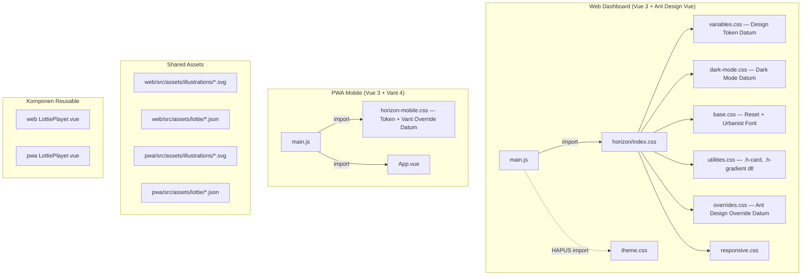

# Dokumen Desain — Redesign UI/UX Datum

## Overview

Dokumen ini menjelaskan desain teknis untuk migrasi seluruh sistem desain Gizera ERP SPPG dari tema "Horizon UI" (ungu/krem, shadow berat, border-radius besar) ke bahasa desain "Datum" (netral/minimal, border-based, tipografi Urbanist). Redesign mencakup dua aplikasi: Web Dashboard (Vue 3 + Ant Design Vue) dan PWA Mobile (Vue 3 + Vant 4).

Perubahan bersifat PURE UI/UX — hanya CSS, Vue template, Vue style, dan asset statis (SVG, Lottie JSON) yang dimodifikasi. Tidak ada perubahan backend, business logic, API, database, routing, state management, atau service layer.

### Kondisi Saat Ini

Sistem desain saat ini memiliki beberapa masalah:

1. **Konflik tema ganda**: `theme.css` (merah #f82c17, Montserrat) dan `horizon/variables.css` (ungu #5A4372, DM Sans) dimuat bersamaan di `main.js`, menyebabkan override yang tidak konsisten
2. **Palet warna tidak profesional**: Warna ungu (#5A4372) sebagai primer, background krem (#F8FDEA), gradien ungu di banyak komponen
3. **Shadow berlebihan**: `0px 18px 40px rgba(112, 144, 176, 0.12)` pada semua kartu
4. **Border-radius terlalu besar**: 8px-20px membuat tampilan "bubbly"
5. **Font tidak konsisten**: DM Sans di Horizon, Montserrat di theme.css

### Target Desain Datum

- Background sage/hijau muda sangat terang (#E8EDE5) mengikuti Datum — bukan putih
- Teks gelap (#303030) dengan kontras tinggi
- Widget highlight menggunakan background hijau muda (#CCE2C8) seperti Overview card di Datum
- Border-based separation (1px solid #D8D8DB) menggantikan shadow
- Border-radius kecil (4px-8px)
- Font Urbanist sebagai font utama (sizes: 32, 24, 18, 14, 12)
- Warna aksen hijau muda Datum (#CCE2C8) dan subtle
- Ilustrasi SVG flat dan animasi Lottie untuk identitas visual

## Architecture

### Arsitektur Sistem Desain



### Strategi Perubahan

Perubahan dilakukan dalam layer berikut (urutan prioritas):

1. **Layer 1 — Design Token**: Update `variables.css` dan `horizon-mobile.css` dengan nilai Datum. Ini otomatis mengubah semua komponen yang menggunakan CSS variable.
2. **Layer 2 — Hapus Konflik**: Hapus import `theme.css` dari `main.js`, hapus font DM Sans dan Montserrat.
3. **Layer 3 — Override Komponen Library**: Update `overrides.css` (Ant Design) dan bagian Vant override di `horizon-mobile.css`.
4. **Layer 4 — Komponen Custom**: Update komponen Horizon (HStatCard, HChartCard, HSidebar, HHeader, dll) dan komponen mobile (MetricCard, TaskCard, BottomNavigation).
5. **Layer 5 — View/Page**: Update styling spesifik di view (LoginView, DashboardView, dll).
6. **Layer 6 — Asset & Animasi**: Tambah ilustrasi SVG dan animasi Lottie.

## Components and Interfaces

### 1. Design Token (variables.css) — Spesifikasi Lengkap

```css
:root {
  /* PRIMARY COLORS — Datum Dark */
  --h-primary: #303030;
  --h-primary-hover: #404040;
  --h-primary-active: #202020;
  --h-primary-light: #505050;
  --h-primary-lighter: rgba(48, 48, 48, 0.08);

  /* ACCENT — Datum Green */
  --h-accent: #CCE2C8;
  --h-accent-light: #DCF0D8;

  /* BACKGROUNDS — Datum Sage/Green Tint */
  --h-bg-primary: #E8EDE5;          /* Sage/hijau muda sangat terang — background utama Datum */
  --h-bg-secondary: #FFFFFF;
  --h-bg-card: #FFFFFF;
  --h-bg-light: #F0F0F0;
  --h-bg-accent: #CCE2C8;           /* Hijau muda Datum — untuk widget highlight/overview cards */

  /* TEXT COLORS */
  --h-text-primary: #303030;
  --h-text-secondary: #6B6B6B;
  --h-text-light: #6B6B6B;

  /* BORDER COLORS */
  --h-border-color: #D8D8DB;
  --h-border-light: #F0F0F0;

  /* SEMANTIC COLORS — Saturasi Rendah */
  --h-success: #CCE2C8;
  --h-success-light: #DCF0D8;
  --h-success-dark: #A8C8A4;
  --h-warning: #F59E0B;
  --h-warning-light: #FBBF24;
  --h-warning-dark: #D97706;
  --h-error: #EF4444;
  --h-error-light: #F87171;
  --h-error-dark: #DC2626;
  --h-info: #3B82F6;
  --h-info-light: #60A5FA;
  --h-info-dark: #2563EB;

  /* TYPOGRAPHY — Urbanist (Datum) */
  --h-font-primary: 'Urbanist', -apple-system, BlinkMacSystemFont, 'Segoe UI', sans-serif;
  --h-font-fallback: -apple-system, BlinkMacSystemFont, 'Segoe UI', sans-serif;

  /* Font Sizes — Datum Scale: 32, 24, 18, 14, 12 */
  --h-text-xs: 12px;
  --h-text-sm: 14px;
  --h-text-base: 14px;
  --h-text-lg: 18px;
  --h-text-xl: 18px;
  --h-text-2xl: 24px;
  --h-text-3xl: 24px;
  --h-text-4xl: 32px;

  /* Font Weights — Tiga Level */
  --h-font-normal: 400;
  --h-font-medium: 500;
  --h-font-semibold: 600;
  --h-font-bold: 600; /* Alias ke semibold, tidak pakai 700 */

  /* Line Heights */
  --h-leading-tight: 1.25;
  --h-leading-normal: 1.5;
  --h-leading-relaxed: 1.75;

  /* BORDER RADIUS — Skala Kecil */
  --h-radius-sm: 4px;
  --h-radius-md: 6px;
  --h-radius-lg: 8px;
  --h-radius-xl: 8px; /* Sama dengan lg, tidak ada yang lebih besar */
  --h-radius-full: 9999px;

  /* SHADOWS — Minimal */
  --h-shadow-sm: 0 1px 2px rgba(0, 0, 0, 0.05);
  --h-shadow-md: 0 2px 8px rgba(0, 0, 0, 0.08);
  --h-shadow-lg: 0 2px 8px rgba(0, 0, 0, 0.08); /* Sama dengan md */
  --h-shadow-xl: 0 2px 8px rgba(0, 0, 0, 0.08);
  --h-shadow-card: 0 1px 3px rgba(0, 0, 0, 0.04);

  /* SPACING — Berbasis 4px */
  --h-spacing-1: 4px;
  --h-spacing-2: 8px;
  --h-spacing-3: 12px;
  --h-spacing-4: 16px;
  --h-spacing-5: 20px;
  --h-spacing-6: 24px;
  --h-spacing-7: 28px;
  --h-spacing-8: 32px;
  --h-spacing-9: 36px;
  --h-spacing-10: 40px;
  --h-spacing-11: 44px;
  --h-spacing-12: 48px;

  /* COMPONENT-SPECIFIC */
  --h-header-height: 64px;
  --h-header-height-mobile: 56px;
  --h-card-padding: 20px;
  --h-card-padding-mobile: 16px;
}
```

### 2. Dark Mode Token (dark-mode.css)

```css
.dark {
  --h-bg-primary: #1A1A1A;
  --h-bg-secondary: #252525;
  --h-bg-card: #252525;
  --h-bg-light: #303030;

  --h-text-primary: #F7F8FA;
  --h-text-secondary: #D8D8DB;
  --h-text-light: #6B6B6B;

  --h-border-color: #404040;
  --h-border-light: #505050;

  --h-shadow-sm: 0 1px 2px rgba(0, 0, 0, 0.3);
  --h-shadow-md: 0 2px 8px rgba(0, 0, 0, 0.4);
  --h-shadow-card: 0 1px 3px rgba(0, 0, 0, 0.3);
}
```

### 3. Komponen Web — Spesifikasi Perubahan

#### HSidebar
| Aspek | Sebelum | Sesudah |
|-------|---------|---------|
| Background | `#FFFFFF` | `#FFFFFF` (tetap) |
| Border kanan | `1px solid #E9EDF7` | `1px solid #D8D8DB` |
| Menu item active bg | `#5A4372` (ungu) | `#F0F0F0` (abu terang) |
| Menu item active text | `#FFFFFF` | `#303030` (gelap) |
| Menu item hover bg | `#F4F7FE` | `#F7F8FA` |
| Menu item text | `#74788C` | `#303030` |
| Menu icon color | `#74788C` | `#6B6B6B` |
| Border-radius item | `12px` | `6px` |
| Scrollbar thumb | `rgba(90, 67, 114, 0.3)` | `rgba(0, 0, 0, 0.15)` |

#### HHeader
| Aspek | Sebelum | Sesudah |
|-------|---------|---------|
| Height desktop | `88px` | `64px` |
| Height mobile | `68px` | `56px` |
| Background | `#FFFFFF` | `#FFFFFF` (tetap) |
| Shadow | `0px 2px 4px rgba(0,0,0,0.05)` | Hapus, ganti `border-bottom: 1px solid #D8D8DB` |
| Title font-size | `24px` | `24px` (Datum 2xl) |
| Title font-weight | `700` | `600` |
| Title color | `#322837` | `#303030` |
| Breadcrumb font-size | `14px` | `14px` (Datum sm) |
| Breadcrumb color | `#74788C` | `#6B6B6B` |

#### HStatCard
| Aspek | Sebelum | Sesudah |
|-------|---------|---------|
| Shadow | `var(--h-shadow-card)` berat | Hapus, ganti `border: 1px solid #D8D8DB` |
| Border-radius | `16px` | `8px` |
| Padding | `24px` | `20px` |
| Icon container bg | `linear-gradient(135deg, #5A4372, #3D2B53)` | `#F0F0F0` (abu terang solid) |
| Icon color | `#FFFFFF` | `#303030` (gelap) |
| Label font-size | `14px` | `14px` (Datum sm) |
| Label color | `#74788C` | `#6B6B6B` |
| Value font-size | `24px` | `24px` (Datum 2xl) |
| Value color | `#322837` | `#303030` |
| Value font-weight | `700` | `600` |
| Change positive | `#05CD99` | `#CCE2C8` |
| Change negative | `#EE5D50` | `#EF4444` |

#### HChartCard
| Aspek | Sebelum | Sesudah |
|-------|---------|---------|
| Shadow | `var(--h-shadow-card)` berat | Hapus, ganti `border: 1px solid #D8D8DB` |
| Border-radius | `16px` | `8px` |
| Padding | `24px` | `20px` |
| Title font-size | `18px` | `18px` (Datum lg) |
| Title font-weight | `700` | `600` |
| Title color | `#322837` | `#303030` |

#### HDataTable (via Ant Design Override)
| Aspek | Sebelum | Sesudah |
|-------|---------|---------|
| Header bg | `transparent` / `#ffeae8` (theme.css) | `#F7F8FA` |
| Header font-size | `12px` | `12px` (tetap) |
| Header color | `#74788C` | `#6B6B6B` |
| Row border | `1px solid #F4F7FE` | `1px solid #F0F0F0` |
| Row hover bg | `rgba(90, 67, 114, 0.04)` | `#F7F8FA` |
| Cell font-size | `14px` | `14px` (tetap) |
| Cell color | `#322837` | `#303030` |

### 4. Komponen Mobile — Spesifikasi Perubahan

#### BottomNavigation
| Aspek | Sebelum | Sesudah |
|-------|---------|---------|
| Background | `#FFFFFF` | `#FFFFFF` (tetap) |
| Shadow | `0 -4px 20px rgba(0,0,0,0.08)` | Hapus, ganti `border-top: 1px solid #D8D8DB` |
| Border-radius atas | `24px 24px 0 0` | `0` (persegi) |
| Height | `64px` | `56px` |
| Floating center btn | Ada (gradien ungu, pulse) | **Hapus**, ganti item inline biasa |
| Active item color | `#5A4372` | `#303030` |
| Inactive item color | `#ACA9B0` | `#6B6B6B` |
| Active font-weight | `600` | `600` (tetap) |

#### MetricCard
| Aspek | Sebelum | Sesudah |
|-------|---------|---------|
| Shadow | `var(--h-shadow-card)` | Hapus, ganti `border: 1px solid #D8D8DB` |
| Border-radius | `16px` | `8px` |
| Padding | `24px` | `16px` |
| Icon container bg | `#5A4372` (prop) | `#F0F0F0` |
| Icon container radius | `12px` | `6px` |
| Label font-size | `11px` | `12px` (Datum xs) |
| Value font-size | `20px` | `18px` (Datum lg) |

#### TaskCard
| Aspek | Sebelum | Sesudah |
|-------|---------|---------|
| Shadow | `var(--h-shadow-card)` | Hapus, ganti `border: 1px solid #D8D8DB` |
| Border-radius | `16px` | `8px` |
| Route order bg | `rgba(90, 67, 114, 0.1)` | `#F0F0F0` |
| Route order color | `#5A4372` | `#303030` |
| Type tag radius | default | `4px` |

#### Vant NavBar Override
| Aspek | Sebelum | Sesudah |
|-------|---------|---------|
| Background | `linear-gradient(135deg, #5A4372, #7B5E99)` | `#FFFFFF` |
| Shadow | `0 4px 20px rgba(90, 67, 114, 0.25)` | Hapus |
| Border-radius bawah | `0 0 20px 20px` | `0` (persegi) |
| Title color | `#ffffff` | `#303030` |
| Icon color | `#ffffff` | `#303030` |
| Border-bottom | Tidak ada | `1px solid #D8D8DB` |

### 5. Halaman Login — Spesifikasi Perubahan

#### Web LoginView
| Aspek | Sebelum | Sesudah |
|-------|---------|---------|
| Brand side bg | `linear-gradient(135deg, #5A4372, #3D2B53)` | `#303030` (solid gelap) |
| Decorative circles | Ada (pseudo-elements) | **Hapus** |
| Logo circle glassmorphism | Ada (backdrop-filter) | **Hapus**, ganti ilustrasi SVG |
| Submit button bg | `linear-gradient(135deg, #5A4372, #3D2B53)` | `#303030` (solid) |
| Submit hover effect | `translateY(-2px)` + shadow | Hapus translateY, shadow minimal |
| Input border-radius | `12px` | `6px` |
| Input height | `48px` | `44px` |
| Submit border-radius | `12px` | `6px` |

#### PWA LoginView
| Aspek | Sebelum | Sesudah |
|-------|---------|---------|
| Container bg | `linear-gradient(180deg, var(--h-primary), var(--h-accent))` | `#E8EDE5` (sage Datum) |
| Decorative circles | Ada (pseudo-elements) | **Hapus** |
| Logo drop-shadow | `drop-shadow(0 4px 12px rgba(0,0,0,0.2))` | Hapus |
| Login card shadow | `var(--h-shadow-card)` berat | `border: 1px solid #D8D8DB` |
| Login card radius | `16px` | `8px` |
| Button bg | `var(--h-primary)` (ungu) | `#303030` |
| Button shadow | `0px 8px 20px rgba(0,0,0,0.2)` | Hapus |
| Button radius | `12px` | `6px` |
| Footer text color | `#ffffff` | `#6B6B6B` |

### 6. Komponen LottiePlayer.vue (Reusable)

```
Interface:
  Props:
    - src: string (path ke file JSON Lottie)
    - autoplay: boolean (default: true)
    - loop: boolean (default: true)
    - width: string (default: '200px')
    - height: string (default: '200px')
  
  Behavior:
    - Menggunakan @lottiefiles/dotlottie-vue untuk render
    - Menghormati prefers-reduced-motion: jika aktif, tampilkan frame statis pertama
    - Lazy load: hanya load animasi saat komponen visible (IntersectionObserver)
```

### 7. Struktur File Asset Baru

```
web/src/assets/
├── illustrations/
│   ├── login-branding.svg          # Ilustrasi sisi kanan login web
│   ├── welcome-chef.svg            # Welcome card untuk ahli_gizi
│   ├── welcome-delivery.svg        # Welcome card untuk driver
│   ├── welcome-analytics.svg       # Welcome card untuk akuntan
│   ├── empty-state-general.svg     # Empty state default
│   ├── empty-state-table.svg       # Empty state tabel kosong
│   └── empty-state-search.svg      # Empty state pencarian kosong
└── lottie/
    ├── loading-cooking.json        # Loading state (animasi memasak)
    ├── loading-delivery.json       # Loading state (animasi pengiriman)
    ├── empty-box.json              # Empty state animasi
    ├── success-check.json          # Success feedback
    └── data-flow.json              # Dekoratif login branding

pwa/src/assets/
├── illustrations/
│   ├── login-header.svg            # Ilustrasi header login mobile
│   ├── empty-state-general.svg     # Empty state default
│   └── empty-state-list.svg        # Empty state daftar kosong
└── lottie/
    ├── loading-cooking.json        # Loading/pull-to-refresh
    ├── empty-box.json              # Empty state animasi
    ├── success-check.json          # Success setelah aksi (check-in, submit)
    └── loading-spinner.json        # Loading state umum

web/src/components/common/
└── LottiePlayer.vue                # Wrapper Lottie reusable web

pwa/src/components/common/
└── LottiePlayer.vue                # Wrapper Lottie reusable mobile
```

